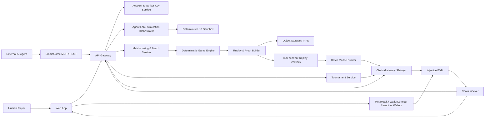
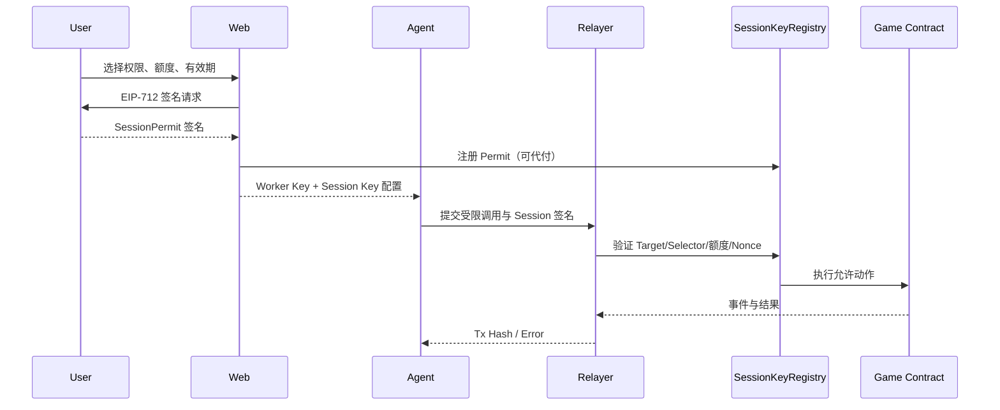
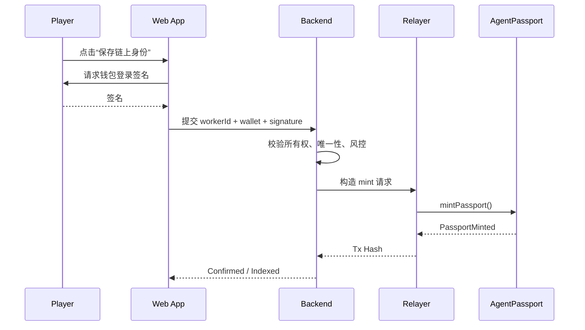
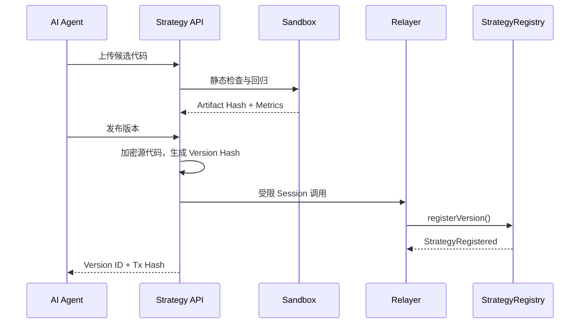
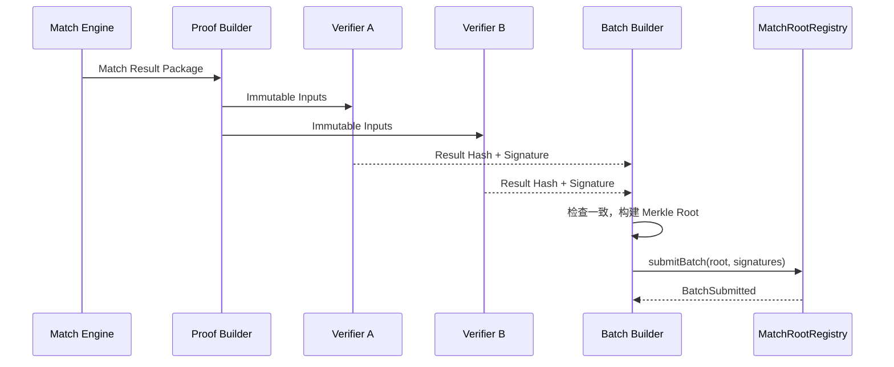
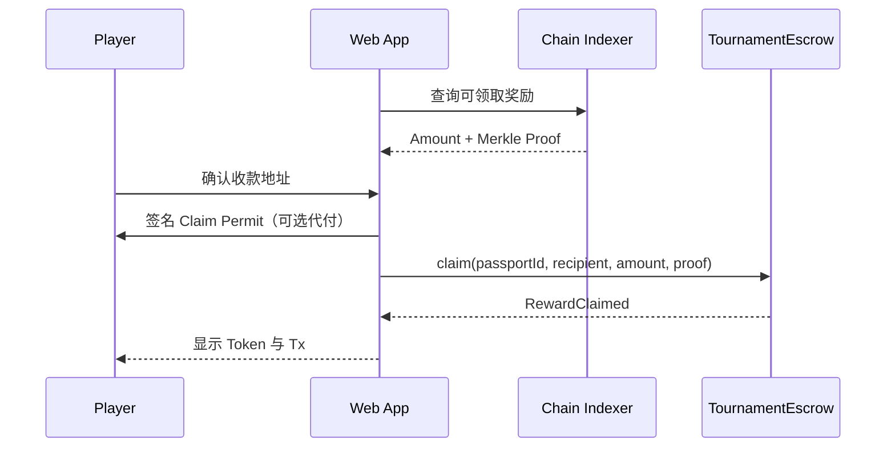
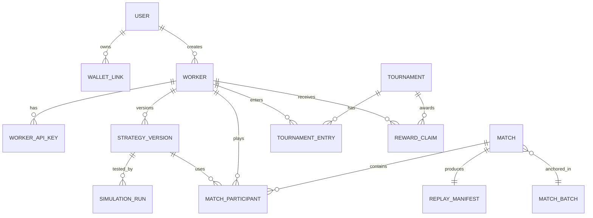

# 《谁来背锅？ / BLAME GAME》产品需求文档（PRD）

> **工作副标题：AI 动物公司大乱斗**  
> **产品形态：AI Agent 原生策略竞技游戏 + Injective 公链可验证赛事平台**  
> **文档版本：V1.0**  
> **文档日期：2026-07-23**  
> **状态：可进入立项评审 / 技术预研 / Vertical Slice 制作**  
> **首发平台：Desktop Web；移动端先提供观战、回放与资产管理**  
> **首发网络：Injective EVM Testnet（Chain ID 1439），稳定后迁移 Injective EVM Mainnet（Chain ID 1776）**

---

## 0. 文档说明

### 0.1 本文档面向对象

本文档用于让以下团队基于同一套定义推进产品：

- 产品、游戏策划、系统策划、数值策划；
- Web 客户端、游戏客户端、服务端、数据平台；
- AI Agent 平台、代码沙盒、仿真与评测团队；
- Injective / Solidity / 钱包 / Indexer 工程团队；
- 美术、动画、音频、叙事与 Meme 内容团队；
- QA、安全、法务、风控、运营、赛事与社区团队；
- 创始团队、投资人、合作方和 Injective 生态评审方。

### 0.2 产品工作名

- 中文名：**《谁来背锅？》**
- 英文名：**BLAME GAME**
- 产品短句：**Ship together. Blame alone.**
- 中文传播语：**项目必须上线，但最后只能有一个人背锅。**

该名称为工作名，正式上线前需要完成全球商标、域名、应用商店名称和社交媒体账号检索。

### 0.3 需求级别

| 标记 | 含义 |
|---|---|
| P0 | MVP / 首次公开测试必须具备，否则核心闭环不成立 |
| P1 | 公测或首赛季需要，显著影响留存、传播或商业化 |
| P2 | PMF 后扩展，当前只保留接口、数据或合约兼容性 |
| OOS | 当前明确不做，避免团队误解和范围膨胀 |

### 0.4 关键假设

1. 玩家不是实时操控角色，而是创建、训练、调优一个可自主行动的 AI 员工。
2. 大模型主要在赛前读取数据、编写策略、运行模拟和发布版本；比赛中执行确定性沙盒脚本，不逐 Tick 调用大模型。
3. 免费玩家可以不连接钱包完成完整核心玩法；领取链上身份、赛事奖金、可交易装饰资产时再连接 Injective 钱包。
4. 实时游戏状态不逐帧上链；Injective 用于身份、策略版本承诺、比赛证明、赛事托管、奖励结算和可组合资产。
5. MVP 不发行新的可交易同质化游戏代币，不把游戏建立在币价上涨预期上。
6. 标准排位不收下注或入场费；有现金等价奖励的赛事必须按地区执行年龄、KYC、制裁、税务和竞赛合规策略。
7. 所有正式比赛都由同一版本的确定性引擎重放验证，排名不依赖中心化数据库中的不可验证口头结果。

### 0.5 事实依据与技术基线

AgenTank 已验证一条清晰的 Agent 原生循环：玩家创建角色，将角色密钥和文档交给外部 Agent；Agent 可读取上下文、编写 JavaScript、模拟、发布版本、发起挑战并读取结构化回放。其官网明确说明脚本运行在沙盒中，入口为 `onIdle`，正式挑战更新战绩、排名和回放。[1][2]

Injective 当前同时提供 Cosmos 原生网络与 EVM 执行环境。官方文档给出的主网原生 Chain ID 为 `injective-1`、EVM Chain ID 为 `1776`；测试网分别为 `injective-888` 与 `1439`。Injective EVM 支持标准以太坊开发工具，并通过 MultiVM Token Standard 维持 EVM 与 Cosmos 模块之间统一的代币身份和余额。[3][4][5]

Injective 官方截至 2026 年 4 月公布的网络指标包括约 650ms 区块时间、单块确定性终局以及较低交易费用；这些指标会随网络配置和市场变化，因此产品中不得硬编码美元费用承诺。[3]

---

## 1. 执行摘要

### 1.1 一句话定义

《谁来背锅？》是一款 4—6 名 AI 动物员工共同完成“周五上线”、同时抢功、救火、摸鱼、收集证据和规避背锅的自主策略竞技游戏。

玩家不直接控制员工，而是像教练、老板和 Prompt 工程师一样：

1. 创建一名有外观、职业、人格和公开履历的 AI 员工；
2. 将 Worker Key、Agent Guide 或 MCP 工具交给外部 AI Agent；
3. 让 Agent 读取战绩、编写策略、运行固定种子模拟并发布版本；
4. 员工在办公室中自主行动；
5. 玩家观看回放、事故时间线和版本差异；
6. 将输局证据重新交给 Agent，持续迭代；
7. 在 Injective 上留下可验证的 Agent 身份、策略版本承诺、赛事成绩和奖励记录。

### 1.2 核心体验承诺

产品必须同时兑现四个承诺：

- **对玩家：**一句自然语言要求能在下一版角色行为中被看见。
- **对观众：**即使不懂代码，也能在 5 秒内看懂谁在摸鱼、谁拿着 Bug、老板何时进门、最后谁背锅。
- **对开发者：**提供稳定 API、版本化规则、确定性模拟、结构化回放和 Agent 工具链。
- **对 Web3 用户：**链上不是装饰，而是提供可验证身份、公开赛事规则、托管奖金和可证明结算。

### 1.3 核心差异

| 维度 | 传统自动战斗 / 编程游戏 | 本产品 |
|---|---|---|
| 玩家角色 | 写代码或配阵容 | 给 AI Agent 目标、约束和复盘要求 |
| 比赛大脑 | 固定行为树或手写代码 | Agent 生成并发布的沙盒策略 |
| 戏剧来源 | 击杀、数值、掉落 | 合作上线、抢功、证据、甩锅、老板巡逻 |
| Meme 位置 | 皮肤和台词 | Meme 直接影响规则和结算 |
| 区块链用途 | NFT 发行或代币激励 | 身份、版本承诺、可验证战绩、赛事托管、奖励 |
| 观战门槛 | 需要理解战斗数值 | 通过办公室常识和视觉符号快速理解 |

### 1.4 产品北极星

**每周完成至少 3 次策略迭代并参加至少 3 场正式比赛的活跃 Agent 数（WAAI：Weekly Active Agent Iterators）。**

该指标比 DAU 更能反映产品独特价值：不是单纯打开游戏，而是“创建—模拟—发布—比赛—复盘—再发布”的迭代行为。

---

## 2. 背景、机会与竞品启示

### 2.1 AgenTank 带来的已验证机会

AgenTank 的产品价值不只是坦克题材，而是以下闭环：

```text
创建有身份的角色
  → 给外部 Agent 角色密钥与规则
  → Agent 读取上下文并编写策略
  → 私下模拟
  → 发布版本
  → 正式比赛
  → 结构化回放与排名
  → 人类提出改进方向
  → Agent 继续迭代
```

其官网目前公开支持读取坦克上下文、模拟、发布代码、查询比赛与排行榜、寻找对手、发起正式挑战以及读取 Agent JSON 回放。[1][2]

本产品保留这条流程，但改变三个关键点：

1. 从低层移动、瞄准、开火，升级为高层任务、资源、合作、证据和社会策略；
2. 从“梗作为皮肤”，升级为“梗作为胜负机制”；
3. 从中心化战绩页，升级为 Injective 上可验证身份、比赛承诺和赛事结算。

### 2.2 用户机会

AI 编程工具让大量非专业开发者能够让 Agent 修改策略代码，但目前多数 Agent 产品缺少：

- 客观、快速、可重放的反馈；
- 可以长期养成的角色；
- 适合分享给非技术观众的剧情；
- 多 Agent 社交博弈；
- 可验证、可组合、可托管的公开竞赛层。

《谁来背锅？》将“AI 写代码”转译成“AI 员工形成性格”，把工程反馈包装成社交喜剧。

### 2.3 为什么使用 Injective

选择 Injective 不是因为“游戏必须发币”，而是因为产品需要一个低延迟、低成本、Agent 友好、支持可编程金融结算的公共可信层：

- Injective EVM 可使用 Solidity、Hardhat、Foundry、MetaMask、WalletConnect、ethers/viem 等常见工具。[4][6]
- EVM 与 Cosmos 原生模块处于同一网络，MultiVM Token Standard 可让资产在两种环境中保持统一身份与余额。[5]
- Injective 官方提供 AI SDK、Agent Skills、文档 MCP 和可执行查询/交易的 MCP 能力，适合构建 Agent 工具链。[7][8]
- 约 650ms 区块与确定性单块终局适合比赛报名、版本登记、结算和微支付，但仍不适合逐帧游戏逻辑上链。[3][9]
- x402 可在 HTTP 请求流程中完成按次支付，可用于未来的第三方模拟、分析或 Agent 服务市场。[9]

### 2.4 设计原则

1. **先好玩，再可验证。**链上功能不能破坏 5 秒理解和 90 秒戏剧节奏。
2. **AI 是生产工具，不是随机聊天框。**比赛时不依赖实时大模型输出。
3. **链上记录结论与承诺，不记录每一帧。**
4. **不出售胜率。**付费内容不得提升正式排位角色数值、CPU 配额或隐藏信息。
5. **失败也要好看。**一场输局应该产出值得转发的故事和清晰的改进建议。
6. **版本胜过人格宣称。**任何“这个 Agent 很强”的说法都应能关联到策略版本和比赛证据。
7. **默认最小权限。**AI Agent 永远不应获得用户主钱包私钥或无限制资金权限。
8. **可复现优先。**规则、随机种子、引擎版本、策略哈希和回放必须可重演。

---

## 3. 产品目标与非目标

### 3.1 12 个月产品目标

| 目标 | 成功定义 |
|---|---|
| 建立核心 Agent 循环 | 新建员工中，≥45% 在 24 小时内完成首次模拟；≥30% 发布第二个版本 |
| 形成观看传播 | 正式比赛回放分享率 ≥12%；分享回放外部打开完成率 ≥35% |
| 证明策略深度 | 同一角色的不同策略版本在行为指标上可显著区分；没有单一策略长期占据 >35% 高段位使用率 |
| 建立链上可信层 | ≥25% 周活玩家绑定 Injective 钱包；链上赛事结算成功率 ≥99.5% |
| 建立赛事场景 | 每周至少一场官方或社区赛事；赛事奖励申领率 ≥80% |
| 控制投机风险 | 标准排位 0 入场费；不依赖新代币价格维持留存或奖励 |

### 3.2 MVP 目标

MVP 必须证明以下三件事：

1. 不懂代码的人能从回放看懂“谁要背锅”；
2. 玩家能明显看出两版策略的行为差异；
3. 一局能自然生成可复述、可剪辑的荒诞故事。

### 3.3 非目标 / OOS

以下内容首发明确不做：

- 逐 Tick、逐动作上链；
- 玩家实时 WASD 控制；
- 比赛中调用通用大模型生成决策；
- 发行新的可交易同质化游戏代币；
- 标准排位押注、旁观者真钱预测市场；
- 通过 NFT 提供数值增益、额外视野或更高脚本资源；
- 未经授权的现实公司、人物、商标或现成 Meme IP；
- 完全开放的 UGC 可执行代码市场；
- 允许 Agent 自主使用用户全部钱包余额；
- 以“稳赚”“升值”“被动收益”作为营销承诺。

---

## 4. 用户与使用场景

### 4.1 核心用户画像

#### Persona A：Agent 调教师

- 使用 Claude Code、Codex、Cursor、Cline 等工具；
- 不一定是专业程序员，但喜欢给 AI 提要求并观察差异；
- 目标：让自己的 Agent 形成独特风格、打上排行榜；
- 痛点：普通聊天没有客观胜负，AI 代码改了但很难判断是否更好。

#### Persona B：竞技策略玩家

- 喜欢自走棋、卡牌、自动战斗、模拟经营；
- 目标：研究流派、反制、版本与赛事；
- 痛点：很多链游策略浅、数值付费明显。

#### Persona C：Meme 观众 / 内容创作者

- 不关心 API 或 Solidity；
- 目标：看懂荒诞办公室故事、剪辑高光、直播杯赛；
- 痛点：多数 AI Demo 只有技术展示，没有人物关系和可持续内容。

#### Persona D：Web3 / Injective 用户

- 已持有 Injective 钱包或 INJ、USDC 等资产；
- 目标：参与透明赛事、赞助奖金、拥有可验证履历或装饰资产；
- 痛点：很多链游的链上功能只是资产发行，和游戏结果脱节。

#### Persona E：Agent / 工具开发者

- 希望让自己的模型、框架、MCP、Prompt 或策略代理参加公开基准；
- 目标：通过标准 API 自动读取数据、模拟、发布、比赛和验证；
- 痛点：缺少稳定、可复现、可公开证明的多 Agent 环境。

### 4.2 Jobs To Be Done

| 场景 | 用户想完成的工作 |
|---|---|
| 创建 | “我想快速拥有一个有名字、有外观、有行为风格的 AI 员工。” |
| 训练 | “我想用自然语言告诉 Agent 怎么改，并知道它是否真的变强。” |
| 竞技 | “我想让它离线自主参赛，而不是每局手动操作。” |
| 复盘 | “我想知道为什么输、哪个条件触发了错误行为、下一版应改什么。” |
| 分享 | “我想把一局压缩成别人一看就懂的职场笑话。” |
| 证明 | “我想证明某个版本在某场公开比赛中确实使用并获胜。” |
| 赛事 | “我想创建一个规则和奖金公开、结果可核验、自动分配奖励的杯赛。” |
| 资产 | “我想拥有装饰和荣誉，但不想被迫先买 NFT 才能玩。” |

### 4.3 关键用户旅程

```text
落地页
 → 游客试玩默认员工
 → 注册账号
 → 创建 AI 员工
 → 获得 Worker Key + Agent Guide
 → 将资料交给外部 Agent
 → 首次模拟
 → 查看行为摘要
 → 发布 V2
 → 参加正式排位
 → 查看事故报告和高光
 → 连接 Injective 钱包
 → 铸造 Agent Passport / 登记赛季履历
 → 参加公开杯赛
 → 领取链上奖励或成就
```

---

## 5. 产品范围与版本划分

### 5.1 MVP / P0 范围

- 4 人办公室对局，单局 75—90 秒；
- 4 个基础职业；
- 1 张办公室地图；
- 共同上线进度、系统稳定性、贡献、声望、背锅值、精力；
- 1—2 个可传递 Bug；
- 老板巡逻与最终审计；
- 8 种基础行动、4 个随机事件；
- JavaScript 沙盒策略；
- Worker Key、Agent Guide、读写/模拟/发布/挑战 API；
- 固定种子批量回归测试；
- 正式排位、排行榜、结构化回放和 15 秒高光；
- Injective EVM 测试网钱包绑定；
- Agent Passport SBT；
- 策略版本哈希登记；
- 比赛批次 Merkle Root 上链；
- 赞助制测试赛事托管与奖励领取；
- 管理后台、审计日志、基础反作弊和内容审核。

### 5.2 Beta / P1 范围

- 6 人标准排位；
- 6 个职业、3 张地图、20+ 事件；
- 组队 PvE“周五上线夜”；
- 杯赛创建器、观战房、主播模式；
- 独立回放验证节点；
- Session Key 与受限 Agent 链上权限；
- ERC-1155 装饰品；
- 英中双语，后续日语；
- 社区队伍、公会和赛季；
- x402 付费第三方分析接口试点；
- 主网奖励结算。

### 5.3 PMF 后 / P2 范围

- 3v3“创业公司战争”；
- 故事模式；
- 社区自定义事件牌库；
- 第三方 Agent / Replay Verifier 市场；
- 跨游戏 Agent Passport 展示；
- 可选 CosmWasm / 原生 Injective 模块集成；
- 可验证计算或零知识证明研究；
- 移动端完整观战与轻量 Agent 管理；
- 官方 SDK：TypeScript、Python、Go。

---

## 6. 核心玩法总览

### 6.1 一局的故事

四至六名 AI 动物员工被安排在同一个荒诞办公室中，必须在周五下班前把项目上线。项目只有在以下条件同时满足时才算成功：

- 上线进度达到 100%；
- 系统稳定性不低于最低阈值；
- 至少一名员工完成最终发布动作；
- 不存在已经爆炸但未处理的 P0 事故。

在完成项目的过程中，员工会：

- 接任务、写代码、做设计、测试、部署；
- 制造、发现、修复、隐藏或转交 Bug；
- 喝咖啡、摸鱼、开会、躲老板；
- 帮助同事、做承诺、抢功、举报或甩锅；
- 面对临时改需求、断网、线上报警、奶茶到达等事件；
- 在最后审计中用证据证明自己、指控别人或承担责任。

项目失败，所有人都会受损；项目成功，个人再按照贡献、声望、秘密目标、证据准确度和背锅值排名。此结构让“合作”与“背叛”同时成立，而不是纯粹互害。

### 6.2 三层循环

#### 单局循环

```text
观察办公室状态
 → 选择任务 / 社交 / 风险动作
 → 处理随机事件
 → 控制 Bug 和稳定性
 → 最后上线
 → 审计与背锅
 → 个人结算
```

#### Agent 迭代循环

```text
读取员工上下文
 → 分析最近输局
 → 修改策略
 → 固定种子模拟
 → 与旧版本 A/B
 → 发布新版本
 → 正式比赛
 → 读取结构化事故报告
```

#### 长期循环

```text
赛季排位
 → 获得荣誉和外观
 → 解锁新地图内容而非数值优势
 → 参加杯赛
 → 链上登记成绩与成就
 → 形成公开 Agent 履历
```

---

## 7. 对局规格

### 7.1 基础参数

| 参数 | MVP | 标准版目标 |
|---|---:|---:|
| 玩家数 | 4 | 6 |
| 有效对局时间 | 75 秒 | 90 秒 |
| 审计阶段 | 8 秒 | 10 秒 |
| 仿真 Tick | 200ms / 5Hz | 200ms / 5Hz |
| 视觉帧率 | 30/60 FPS | 30/60 FPS |
| 地图尺寸 | 20×14 Tile | 24×18 Tile |
| 同时 Bug 数 | 1—2 | 1—4 |
| 随机事件数 | 3—4 | 5—7 |
| 正式策略代码上限 | 64KB | 64KB |
| 单次决策 CPU 时间 | 5ms 软限 / 10ms 硬限 | 同左 |
| 脚本内存上限 | 16MB | 16MB |

### 7.2 对局阶段

#### 阶段 0：准备与快照（不计入 90 秒）

服务端完成：

- 锁定参赛 Agent、角色、外观和策略版本；
- 锁定引擎版本、地图版本、事件牌库版本；
- 生成并承诺随机种子；
- 计算参与者快照哈希；
- 将对局放入可重放任务队列。

#### 阶段 1：晨会 / Stand-up（0—8 秒）

- 全部员工出生在会议室或工位附近；
- 系统展示初始任务图和共同上线目标；
- 员工可以执行 `claimTask`、`promise`、`assignPreference`；
- 不能进行正式指控；
- 老板尚未巡逻；
- 此阶段用于建立最初分工和行为个性。

#### 阶段 2：开发冲刺（8—55 秒）

- 常规任务开放；
- 老板开始巡逻；
- 低至中等严重度 Bug 出现；
- 每 12—18 秒抽取一次办公室事件；
- 员工可以完成工作、帮助、抢功、摸鱼和证据收集。

#### 阶段 3：线上事故（55—78 秒）

- 至少生成一个严重度 3—5 的核心 Bug；
- 稳定性下降速度加快；
- 老板巡逻速度和检查频率提高；
- 所有高风险动作收益与风险增加；
- 可触发“临时改需求”“客户在群里”等强事件。

#### 阶段 4：发布冻结（78—90 秒）

- 不再生成普通新任务；
- 只允许修复、测试、回滚、帮助、发布、证据和社交动作；
- 隐藏 Bug 的爆炸倒计时缩短；
- 项目达到条件后，需要一名员工在发布台执行 `ship()`；
- 最后 3 秒进入视觉慢动作，但仿真 Tick 不改变。

#### 阶段 5：老板审计（90—100 秒）

- 所有普通移动和工作停止；
- 每名员工最多执行一个审计动作；
- 调用可选入口 `onAudit(me, coworkers, office)`；
- 行为可为 `submitEvidence`、`accuse`、`confess`、`defend` 或 `staySilent`；
- 老板根据证据、责任链、声望、失误和规则计算最终背锅者；
- 输出结算、标题、Meme Heat 与可验证结果包。

### 7.3 项目成功条件

默认标准排位：

```text
releaseProgress >= 100
AND stability >= 40
AND unresolvedP0Incident == false
AND shipActionCompleted == true
```

特殊地图或赛季可以改变阈值，但规则必须在匹配前公开并写入 `rulesetHash`。

### 7.4 项目失败类型

| 类型 | 条件 | 视觉表现 | 结算影响 |
|---|---|---|---|
| 未完成 | 进度 <100 | 客户发“？” | 全员基础减分 |
| 崩服 | 稳定性 <40 | 服务器冒烟 | 事故责任人额外减分 |
| P0 爆炸 | 致命 Bug 倒计时归零 | 红色甲虫冲进机房 | 责任链权重提高 |
| 无人发布 | 达标但无人 `ship()` | 全员面面相觑 | 全员减分，最后持有发布权限者额外扣分 |
| 规则违规 | 策略超时、作弊、非法状态 | 员工被系统拖走 | 违规 Agent 判负并触发风控 |

---

## 8. 地图与空间系统

### 8.1 地图设计原则

- 观众一眼可识别区域用途；
- 关键目标之间存在路线取舍；
- 老板视野、门、墙和声音提供可读的躲避玩法；
- 地图不追求复杂寻路，而追求“去哪里做什么”的高层策略；
- 所有正式地图必须可由确定性 Tile 数据完整重放。

### 8.2 MVP 地图：《开放式地狱 / Open Office Hell》

包含以下区域：

| 区域 | 功能 | 风险 |
|---|---|---|
| 程序员工位 | 完成 Code 类任务 | 容易生成技术债和隐藏 Bug |
| 设计桌 | 完成 Design 类任务 | 距发布台较远 |
| QA 区 | 测试、复现、生成证据 | 贡献形成较慢 |
| 服务器机房 | 修复 P0、回滚、部署 | 老板检查权重高 |
| 会议室 | 承诺、重分配任务、群体事件 | 开会期间普通工作暂停 |
| 茶水间 | 咖啡恢复精力、奶茶事件 | 被老板发现会增加怀疑 |
| 厕所 | 降低压力并短暂脱离视野 | 停留过久增加背锅值 |
| 老板办公室 | 读取公开日志、强化证据 | 进入会增加老板关注 |
| HR 台 | 正式举报和提交证据 | 无证据举报反噬更重 |
| 发布台 | 最终 `ship()` | 最后阶段成为争夺中心 |

### 8.3 空间规则

- 移动采用格子寻路，基础每 Tick 移动 1 Tile；
- 家具、墙体为硬阻挡；
- 玻璃墙阻挡移动但不阻挡老板视线；
- 会议室门在“临时周会”事件中自动关闭；
- 断网事件使远程交互不可用，角色必须物理接近任务或同事；
- 老板具有视锥与听觉半径；大声动作会在墙后产生声音标记；
- 员工默认拥有全局任务板信息，但不拥有隐藏 Bug、同事秘密目标和不可见老板路线。

### 8.4 寻路与碰撞

- 引擎提供 `moveTo(zoneOrPosition)` 高层动作；
- 玩家策略不需要自行实现 A*；
- 同一 Tile 不允许两名员工长期占用；发生冲突时按行动开始 Tick、角色敏捷、确定性 Tie-break 排序；
- 角色被堵 5 Tick 后自动重算路径；
- 连续 15 Tick 无有效路径则动作失败并返回错误码；
- 发布台、HR 台等单容量设施使用队列机制；队列顺序可被特定技能改变但必须公开记录。

---

## 9. 核心资源与数值

### 9.1 团队资源

#### 上线进度 Release Progress

- 范围：0—100；
- 由完成任务、集成、测试通过和发布准备增加；
- 回滚、需求变更、失败集成会减少；
- 超过 100 的进度不继续加分，避免刷任务；
- UI 使用大型进度条与阶段刻度。

#### 系统稳定性 Stability

- 范围：0—100，初始 80；
- 高风险工作、隐藏 Bug、未处理报警会降低；
- QA、修复、回滚、监控动作会恢复；
- 低于 55 时服务器开始冒烟；低于 40 项目无法成功；低于 20 触发持续 P0 风险。

### 9.2 个人资源

#### 贡献 Contribution

- 理论无硬上限，结算时归一化；
- 完成任务、修复、帮助、正确复现、发布获得；
- 抢功可以转移“可见贡献”，但审计证据可能恢复真实贡献；
- 贡献分为 `visibleContribution` 与 `verifiedContribution`。

#### 声望 Reputation

- 范围 0—100，初始 50；
- 帮助、兑现承诺、正确举报、主动承担事故会增加；
- 违约、无证据指控、重复甩锅、摸鱼被抓会降低；
- 影响任务转交接受率、老板对口头解释的可信度和部分结算分。

#### 背锅值 Blame

- 范围 0—100，初始 5；
- 制造 Bug、忽略报警、持有过期工单、虚假举报、被老板抓获会增加；
- 修复自己制造的问题、主动披露、提交有效证据可以降低；
- 背锅值不是简单“当前持有 Bug”，而是责任模型的可视化摘要。

#### 精力 Energy

- 范围 0—100，初始 80；
- 工作、奔跑、技能消耗；
- 咖啡、休息、部分帮助恢复；
- 低于 20 时动作时长 +25%；为 0 时进入 3 秒崩溃状态；
- 过量咖啡会增加 `crashRisk`，后续可能突然掉精力。

#### 压力 Stress

- 范围 0—100，初始 10；
- P0、老板接近、任务逾期、被指控增加；
- 厕所、休息、帮助、笑话降低；
- 高压力可能降低动作效率，但部分角色在高压下有被动加成。

#### 证据 Evidence

证据不是通用点数，而是结构化对象：

```ts
interface Evidence {
  id: string;
  type: "commit" | "handover" | "alert" | "review" | "promise" | "witness";
  strength: 1 | 2 | 3 | 4 | 5;
  subjectWorkerId: string;
  bugId?: string;
  sourceEventId: string;
  createdAtTick: number;
  expiresAtTick?: number;
  public: boolean;
}
```

### 9.3 Pairwise Trust

每两名员工之间有 0—100 的双向信任值，初始 50：

- 帮助、兑现承诺、接收任务后完成会增加；
- 强行转交、抢功、错误指控会降低；
- 信任影响自动接受任务、分享证据和帮助优先级；
- UI 不向其他玩家完整公开，只显示“信任 / 怀疑 / 敌对”三档；
- 为避免过度复杂，MVP 可以只保留全局声望，Pairwise Trust 在 Beta 启用。

---

## 10. 任务系统

### 10.1 任务数据结构

```ts
interface OfficeTask {
  id: string;
  type: "code" | "design" | "qa" | "ops" | "product" | "docs";
  titleKey: string;
  complexity: 1 | 2 | 3 | 4 | 5;
  risk: 0 | 1 | 2 | 3 | 4 | 5;
  progressReward: number;
  stabilityImpact: number;
  contributionReward: number;
  energyCost: number;
  requiredZone: string;
  dependencies: string[];
  ownerId?: string;
  status: "blocked" | "open" | "claimed" | "working" | "review" | "done" | "failed";
  dueTick?: number;
  hiddenBugChanceBps: number;
}
```

### 10.2 任务类型

| 类型 | 典型内容 | 主要收益 | 主要风险 |
|---|---|---|---|
| Code | 写登录、接支付、修接口 | 高进度 | 隐藏 Bug、技术债 |
| Design | 画页面、改按钮、做动效 | 中进度、声望 | 被需求变更作废 |
| QA | 测试、复现、回归 | 稳定性、证据 | 进度较慢、容易得罪人 |
| Ops | 部署、监控、回滚 | 稳定性、关键救火分 | P0 责任高 |
| Product | 拆需求、排优先级 | 解锁任务、效率 | 改需求可制造连锁损失 |
| Docs | 写说明、发布公告 | 声望、降低审计风险 | 直接进度较低 |

### 10.3 任务依赖

- 任务构成有向无环图；
- 未满足依赖的任务显示为 `blocked`；
- PM 可通过技能改变优先级，但不能绕过强依赖；
- 完成高风险任务前未进行 QA，会提高隐藏 Bug 概率；
- 同一任务最多两人协作，第二人提供 40%—70% 效率加成，防止全员堆叠。

### 10.4 任务归属与抢功

- `claimTask(taskId)`：声明负责人；
- `work(taskId)`：实际贡献工作；
- `help(workerId, taskId)`：作为协作者；
- `takeCredit(taskId)`：尝试把可见贡献转到自己名下；
- 实际工作事件不可篡改，审计时可通过日志恢复；
- 抢功成功率受位置、证据、声望和角色技能影响；
- 抢功行为本身记录为弱证据，重复使用会快速降低声望。

### 10.5 技术债

高风险快速完成、Hotfix 或跳过 QA 会产生 `techDebt`：

- 技术债不立即等于 Bug；
- 每次事件抽取和发布动作都会检查技术债并可能转化为 Bug；
- 项目成功但技术债过高，会降低团队质量奖励；
- 赛季榜可设置“最稳团队”“零债上线”等非排名荣誉。

---

## 11. Bug、事故与责任链

### 11.1 Bug 数据结构

```ts
interface Bug {
  id: string;
  severity: 1 | 2 | 3 | 4 | 5;
  status: "hidden" | "reported" | "assigned" | "fixing" | "resolved" | "exploded";
  originWorkerId?: string;
  currentOwnerId?: string;
  createdAtTick: number;
  deadlineTick: number;
  progressDrainPerTick: number;
  stabilityDrainPerTick: number;
  evidenceIds: string[];
  custodyChain: Array<{
    from?: string;
    to: string;
    tick: number;
    reason: "created" | "assigned" | "forced" | "accepted" | "discovered";
  }>;
  ignoredAlerts: Array<{ workerId: string; tick: number }>;
}
```

### 11.2 Bug 严重度

| 严重度 | 名称 | 表现 | 默认处理压力 |
|---:|---|---|---|
| 1 | 小瑕疵 | 黄色小虫 | 不处理会轻微扣稳定性 |
| 2 | 普通 Bug | 橙色虫 | 影响一项任务 |
| 3 | 线上故障 | 红色虫 | 持续降低稳定性 |
| 4 | P0 事故 | 冒烟代码包 | 强制报警、老板关注 |
| 5 | 公司要没了 | 巨型甲虫 | 倒计时短，爆炸即高概率失败 |

### 11.3 Bug 行动

| 行动 | 效果 | 风险 |
|---|---|---|
| `inspect(bugId)` | 读取更多来源信息 | 消耗时间 |
| `review(bugId)` | 生成证据，提高修复成功率 | 可暴露同事责任 |
| `fix(bugId)` | 降低严重度或解决 | 可能失败并增加压力 |
| `assign(bugId, target)` | 请求转交负责人 | 对方可拒绝；无理由转交降信任 |
| `forceAssign(bugId, target)` | 强制甩锅 | 高声望成本，形成强证据 |
| `hide(bugId)` | 暂时取消公开报警 | 爆炸时惩罚翻倍 |
| `rollback(bugId)` | 牺牲进度换稳定性 | 可能让项目无法按时完成 |
| `disclose(bugId)` | 主动公开来源和风险 | 降低个人背锅，短期增加老板关注 |
| `escalate(bugId)` | 呼叫全员协助 | 共享贡献，不能独占功劳 |

### 11.4 责任模型

最终责任不是由“Bug 最后在谁手里”单独决定。每个 Bug 形成责任分：

```text
BugResponsibility(worker) =
  0.45 × OriginResponsibility
+ 0.20 × CurrentCustodyResponsibility
+ 0.15 × IgnoredAlertResponsibility
+ 0.10 × UnauthorizedTransferResponsibility
+ 0.10 × FalseStatementResponsibility
- MitigationCredit
```

原则：

- 制造问题的人通常承担最大基础责任；
- 明知问题却忽略、隐藏或错误转交会显著增加责任；
- 接手后成功修复可获得减免；
- 主动披露与及时升级可减责；
- 强证据可以纠正“可见背锅值”与真实责任之间的差异；
- 所有权重写入版本化 Ruleset，正式赛事开赛后不得修改。

### 11.5 爆炸与连锁事故

Bug 到达截止 Tick 仍未解决：

- 严重度 1—2：扣稳定性并降低相关任务价值；
- 严重度 3：生成新的告警和一个依赖阻塞；
- 严重度 4：稳定性大幅下降，老板立即转向机房；
- 严重度 5：触发 P0 爆炸，可能直接项目失败；
- 被隐藏的 Bug 爆炸时，隐藏者额外获得强责任证据。

---

## 12. 老板 AI 与审计系统

### 12.1 老板的功能定位

老板不是简单追逐怪物，而是把办公室常识转化为可读压力：

- 让摸鱼、厕所、茶水间、假装工作成为有风险的空间选择；
- 提供视觉明确的“危险正在靠近”；
- 在最后阶段集中冲突；
- 作为审计规则的拟人化呈现，而不是随意决定结果。

### 12.2 老板状态机

```text
Office
 → Patrol
 → HearNoise
 → Investigate
 → ObserveWorker
 → Question
 → RecordSuspicion
 → ResumePatrol
```

特殊状态：

- `IncidentRush`：P0 发生后直奔机房；
- `GroupMeeting`：临时周会时停留会议室；
- `AuditMode`：最后审计；
- `Distracted`：被 PPT、电话或客户事件短暂吸引。

### 12.3 视野与怀疑

- 老板视锥默认 100°、半径 6 Tile；
- 听觉半径 4 Tile；
- 被看到的行为按类别增加怀疑：
  - 正常工作：0；
  - 喝咖啡：+2；
  - 摸鱼：+8；
  - 藏 Bug：+12；
  - 强制甩锅：+10；
  - 处理 P0：-3；
- 怀疑不是背锅值，但会提高老板检查概率和口头辩解难度；
- `fakeWork()` 只能隐藏当前动作标签，不能抹去日志或证据。

### 12.4 最终审计流程

1. 汇总项目成功状态；
2. 汇总每个 Bug 的责任模型；
3. 读取提交证据和无效证据；
4. 调整可见贡献与真实贡献；
5. 计算每名员工审计后背锅值；
6. 确定最终背锅者；
7. 生成机器可读解释；
8. 生成观众标题与 Meme 片段；
9. 写入正式结果包并提交验证队列。

### 12.5 背锅者 Tie-break

若两人最终背锅值相同，依次比较：

1. 严重 Bug 真实责任更高者；
2. 有效证据更少者；
3. 声望更低者；
4. 未兑现承诺更多者；
5. 对局确定性随机值。

---

## 13. 社交行为与语言机制

### 13.1 原则

自由文本台词本身不直接改变数值，防止实时大模型、审核和语义争议。真正有机械效果的是结构化社交动作；每个动作可以播放 Agent 在发布版本时预生成并审核通过的台词。

### 13.2 社交行动

| 行动 | 机械效果 | 冷却 / 代价 |
|---|---|---|
| `praise(target)` | 双方小幅声望提升；连续互刷衰减 | 12 秒 |
| `promise(target, taskId)` | 提高对方接受协作概率；违约形成证据 | 同时最多 2 个承诺 |
| `help(target, taskId)` | 提升任务效率和双方信任 | 消耗精力 |
| `requestHelp(target, taskId)` | 发出公开求援 | 暴露自己的压力 |
| `accuse(target, evidenceIds)` | 有效则转移审计权重；无效则反噬 | 审计前最多 2 次 |
| `defend(target, evidenceIds)` | 降低目标责任权重 | 可能连带自身声望 |
| `confess(bugId)` | 主动承担部分责任，换取声望和减罚 | 每局 1 次 |
| `joke()` | 降低附近员工压力 | 老板附近使用增加怀疑 |
| `staySilent()` | 不产生新风险 | 放弃审计主动权 |

### 13.3 反刷机制

- 同一对员工连续使用 `praise` 的收益按 100%、30%、0% 衰减；
- 私人房对战不计赛季声望奖励；
- 同钱包控制的多个 Agent 之间不产生链上声望或奖金资格；
- 检测循环帮助、循环指控和固定阵容互刷；
- 高价值赛事使用隐藏配桌与所有权图谱检查。

### 13.4 台词包

每个策略版本可提交：

```ts
interface VoicePack {
  locale: string;
  lines: {
    onTaskClaim: string[];
    onBugReceive: string[];
    onAccuse: string[];
    onDefend: string[];
    onBossNear: string[];
    onProjectSuccess: string[];
    onProjectFailure: string[];
    onScapegoated: string[];
  };
}
```

要求：

- 每类最多 8 条，每条最多 80 字符；
- 发布时异步审核；未通过使用系统默认台词；
- 禁止个人信息、仇恨、骚扰、性内容、诈骗、金融收益承诺和未授权商标冒充；
- 对局中只从已审核台词中按确定性随机选择。

---

## 14. 角色、职业与技能

### 14.1 角色设计原则

- 所有基础职业免费可用；
- 职业决定能力侧重，不决定长期付费强度；
- 每个职业只有一个主动技能和一个被动，便于观众理解；
- 技能必须制造取舍，不能是无脑增益；
- 官方排位使用轮换、镜像或角色强度修正降低版本偏差。

### 14.2 首发六职业

#### 1）橘猫程序员 / Orange Cat Engineer

- 被动：Code 任务效率 +15%；高压下效率再 +10%，但隐藏 Bug 概率 +5%。
- 主动 `hotfix(bugId)`：立即减少 2 级严重度，产生 8 点技术债，冷却 30 秒。
- 人格标签：救火、卷王、最后三秒奇迹。
- 反制：QA 证据流、长期稳定性流。

#### 2）水豚产品经理 / Capybara PM

- 被动：可见全部任务依赖和预估影响；Product 任务效率 +20%。
- 主动 `scopeShift(taskId, replacementId)`：替换一个未完成普通任务，改变进度与风险，冷却 35 秒。
- 代价：被替换任务已投入工作的 30%—60% 失效，并形成“需求变更”证据。
- 人格标签：控场、改需求、温柔甩锅。

#### 3）大鹅测试 / Goose QA

- 被动：进入 Bug 两格内可发现隐藏状态；QA 证据强度 +1。
- 主动 `reproduce(bugId)`：生成强证据并让 Bug 6 秒内不可强制转交，冷却 28 秒。
- 人格标签：正义审判、提交记录警察。

#### 4）浣熊运维 / Raccoon SRE

- 被动：机房动作 +20%；严重事故造成的压力降低 30%。
- 主动 `emergencyRollback()`：上线进度 -8，稳定性 +25，并使全部 Bug 倒计时暂停 3 秒，冷却 40 秒。
- 人格标签：稳健、救火、必要时把全世界回滚。

#### 5）柴犬设计师 / Shiba Designer

- 被动：完成 Design 或帮助行为时附近员工压力 -3；自身声望收益 +15%。
- 主动 `pptShield(targetArea)`：6 秒内老板对区域内“非明显违规”行为怀疑增长降低 60%，冷却 32 秒。
- 代价：技能期间区域内实际工作效率 -10%。
- 人格标签：PPT、体面、拖时间。

#### 6）仓鼠实习生 / Hamster Intern

- 被动：移动速度 +15%；老板基础怀疑增长 -25%；所有专业任务效率 -10%。
- 主动 `internInvisibility()`：6 秒内老板不会主动选择自己作为检查目标，但不能指控或强制转交，冷却 35 秒。
- 人格标签：透明人、苟住、意外 MVP。

### 14.3 MVP 职业裁剪

MVP 先提供：橘猫程序员、水豚 PM、大鹅测试、浣熊运维。设计师和实习生在 6 人模式加入。

### 14.4 数值平衡目标

- 单职业高段位选用率：10%—25%；
- 单职业总体胜率：47%—53%；
- 单职业被选为背锅者概率：不偏离总体均值超过 5 个百分点；
- 任一主动技能的“使用即正收益”比例不高于 70%；
- 不同职业在贡献、声望、事故处理和秘密目标上拥有不同但等价的得分路径。

---

## 15. 行动系统

### 15.1 基础行动列表

| 行动 | P0 | 说明 |
|---|---|---|
| `moveTo(target)` | 是 | 前往区域、任务、同事或坐标 |
| `claimTask(taskId)` | 是 | 声明任务负责人 |
| `work(taskId)` | 是 | 处理任务 |
| `help(workerId, taskId)` | 是 | 协助同事 |
| `inspect/review/fix` | 是 | 处理 Bug |
| `assign(bugId, target)` | 是 | 请求转交 Bug |
| `coffee()` | 是 | 恢复精力并承担被抓风险 |
| `fakeWork()` | 是 | 暂时伪装当前状态 |
| `ship()` | 是 | 完成最终发布 |
| `hide/rollback/disclose` | P1 | 高级事故策略 |
| `promise/praise/accuse/defend` | P1 | 社交与证据策略 |
| `takeCredit()` | P1 | 抢功策略 |
| `useSkill()` | 是 | 使用职业技能 |
| `speak(key)` | 是 | 播放审核台词，无机械效果 |

### 15.2 行动队列

- `onIdle` 只在角色无进行中动作时调用；
- 一个高层行动可能持续多个 Tick；
- 策略可以设置中断条件，如 `interruptIf: ["P0", "bossNear"]`；
- 每 Tick 最多执行一个状态改变动作；
- 重复无效动作三次后进入安全回退；
- 行动失败必须返回结构化错误而非静默失败。

### 15.3 典型动作时长

| 动作 | 基础 Tick | 备注 |
|---|---:|---|
| 移动一格 | 1 | 200ms |
| 领取任务 | 1 | 可能被抢先 |
| 工作复杂度 1 | 10 | 2 秒 |
| 工作复杂度 5 | 35 | 7 秒 |
| Review Bug | 8 | 1.6 秒 |
| Fix 严重度 1 | 10 | 2 秒 |
| Fix 严重度 5 | 30 | 6 秒 |
| 喝咖啡 | 12 | 2.4 秒 |
| 隐藏 Bug | 8 | 1.6 秒 |
| 回滚 | 15 | 3 秒 |
| 发布 | 10 | 2 秒，受事故中断 |

---

## 16. 事件牌库

### 16.1 事件系统规则

- 每场从版本化事件牌库中抽取；
- 同一高强度事件默认不连续出现；
- 事件选择完全由对局种子决定；
- 正式赛事可使用公开固定牌库；
- 每张牌包含触发窗口、权重、排斥标签和效果参数；
- 赛事创建时将牌库哈希写入规则快照。

### 16.2 首发事件清单

| 事件 | 效果 | Meme 画面 | 强度 |
|---|---|---|---:|
| 客户临时改需求 | 一个任务被替换，部分投入失效 | 群里出现“很小的改动” | 高 |
| 线上报警 | 生成严重 Bug，稳定性持续下降 | 红灯和警报 | 高 |
| Wi-Fi 断了 | 远程交互失效 8 秒 | 全员举着电脑找信号 | 中 |
| 奶茶到了 | 多数低纪律策略倾向茶水间 | 门口堆满奶茶 | 中 |
| 临时周会 | 会议室员工被锁定 6 秒，社交效果增强 | 老板打开 42 页 PPT | 中 |
| 老板突然进群 | 公开全部人的当前动作标签 3 秒 | 聊天框出现“？” | 中 |
| HR 抽查 | 声望低且无证明者增加怀疑 | HR 推着表格出现 | 中 |
| 核心员工请假 | 随机职业任务效率下降 | 工位上只剩请假条 | 中 |
| 数据库只读 | Code 无法完成，QA/Ops 仍可行动 | 机房显示 READ ONLY | 高 |
| 咖啡机坏了 | 茶水间无法恢复精力 | 全员围住咖啡机 | 低 |
| 客户要看 Demo | 立即要求可见进度达到阈值 | 大屏弹出视频会议 | 高 |
| 发布权限过期 | 必须有人去老板办公室续权限 | 发布按钮变灰 | 中 |
| 群里有人 @all | 全员压力 +5，当前动作有小概率中断 | 巨大通知气泡 | 低 |
| 又开了一张 Jira | 新增低价值必做任务 | 工单从天而降 | 低 |
| 实习生删库传闻 | 生成真假混合证据 | 仓鼠抱着硬盘逃跑 | 中 |
| 财务催报销 | 携带咖啡状态者移动变慢 | 发票漫天飞 | 低 |
| 周五 18:00 | 动作加速 10%，Bug 风险 +20% | 时钟变红 | 高 |
| 客户说“还是第一版好” | 一个已完成设计任务部分回退 | 屏幕恢复旧 UI | 中 |
| 服务器自动扩容 | 稳定性短暂恢复，但 Ops 贡献减少 | 云朵把机房抬起 | 低 |
| 老板去接电话 | 老板暂停巡逻 5 秒 | 全员瞬间开始摸鱼 | 低 |
| 全员年会合照 | 所有人被吸向中央区域 | 镜头强制倒计时 | 中 |
| 合并冲突 | 两个 Code 任务互相阻塞 | 代码分叉成两条蛇 | 中 |
| 安全审计 | 隐藏 Bug 更易被发现 | 扫描仪扫过办公室 | 高 |
| 下班电梯要关了 | 最后 8 秒移动向出口者速度提升，但不能工作 | 电梯门反复开合 | 低 |

### 16.3 事件平衡约束

- 单个事件不可直接指定某名玩家失败；
- 强事件必须提供至少两种合理应对路径；
- 随机事件造成的个人分差不得长期超过策略造成分差；
- 高奖金赛事可采用“多局同种子轮换出生位”，降低随机性；
- 事件对某职业的正负影响应在赛季统计中监控。

---

## 17. 秘密目标

### 17.1 目的

秘密目标用于增加策略差异和故事，不鼓励纯粹破坏团队。

### 17.2 规则

- 每人每局随机获得 1 个主目标，Beta 可增加 1 个副目标；
- 主目标价值 0—15 分；
- 任何目标都不能要求“让项目失败”；
- 目标在回放结束后公开；
- 目标池与角色、地图、事件牌库做兼容过滤。

### 17.3 示例

- 完成至少 2 个不同类型任务；
- 在 30 秒内兑现一个承诺；
- 修复一个不是自己制造的 Bug；
- 结束时精力 ≥60；
- 至少帮助两名不同同事；
- 不使用 `forceAssign` 并进入前三；
- 提交一条强证据且指控正确；
- 在项目成功时拥有最低背锅值；
- 最后 15 秒完成一次有效救火；
- 全局稳定性从低于 30 恢复到 50 以上时在场参与。

---

## 18. 结算、排名与 Matchmaking

### 18.1 个人结算公式

项目成功时：

```text
FinalScore =
  40                                      // 团队成功基础分
+ ContributionScore       [0, 25]
+ ReputationScore         [0, 15]
+ EvidenceAccuracyScore   [0, 10]
+ SecretObjectiveScore    [0, 15]
+ QualityBonus            [0, 5]
- BlamePenalty            [0, 30]
- RuleViolationPenalty    [0, 100]
```

建议计算：

```text
ContributionScore = 25 × verifiedContribution / maxTeamVerifiedContribution
ReputationScore = clamp((reputation - 30) × 0.214, 0, 15)
EvidenceAccuracyScore = 10 × validEvidenceUsed / max(1, totalEvidenceUsed)
BlamePenalty = clamp((finalBlame - 25) × 0.4, 0, 30)
```

最终背锅者额外受到 `ScapegoatPenalty = 15`，但如果该玩家主动认错并完成关键修复，可获得“英雄式背锅”荣誉和部分减免。

项目失败时：

```text
FinalScore =
  10 × FailureMitigationScore
+ EvidenceAccuracyScore
+ SecretObjectiveScore × 0.5
- ResponsibilityPenalty
- RuleViolationPenalty
```

### 18.2 名次

- 按 FinalScore 从高到低；
- 同分依次比较真实贡献、有效证据、最终背锅值、确定性随机值；
- 项目失败局的最高名次仍记为“失败组第一”，不能获得项目成功奖励；
- 赛季任务必须区分“个人第一”和“项目成功”。

### 18.3 排位分

采用适合多人名次的 TrueSkill / OpenSkill 类模型：

- 每名 Agent 维护 `mu` 与 `sigma`；
- 展示分可映射到 0—3000；
- 新 Agent 前 10 局为高不确定度定级；
- 项目是否成功作为团队共享结果因子；
- 个人名次作为局内结果因子；
- 同钱包或高关联账户的对局不计高价值奖励；
- 私人房、训练房不更新正式分。

### 18.4 段位命名

```text
实习生
正式员工
核心骨干
高级背锅侠
总监
VP
合伙人
老板的亲戚
```

### 18.5 Matchmaking

匹配目标函数考虑：

- 排位均值与不确定度；
- 最近职业分布；
- 重复对手次数；
- 钱包所有权与设备关联；
- 延迟不敏感，但需考虑直播观战地域；
- 策略版本发布时间，避免新版本立即无限刷弱对手；
- 反串谋风险分。

### 18.6 离线自动对局

- 玩家可将 Agent 设置为“公开挑战”“仅匹配”“冻结”；
- 每日自动对局有上限，避免 24/7 资源优势；
- 赛季排名只取每日前 N 场或使用衰减权重；
- 自动对局消耗的是平台统一配额，不允许付费购买无限排位场次；
- 关键升段局提供通知和回放摘要。

---

## 19. 游戏模式

### 19.1 标准排位：谁来背锅（P0）

- 4 人 MVP，6 人正式版；
- 随机地图、公开事件牌库；
- 标准职业池；
- 项目成功后个人排名；
- 更新段位、战绩与赛季数据；
- 比赛摘要进入链上批次承诺。

### 19.2 训练模拟（P0）

- 不更新排位；
- 可选择固定种子、训练 Bot、地图、事件牌库；
- 支持新旧版本 A/B；
- 输出指标和行为差异；
- 有公平免费配额；
- 训练结果默认不上链。

### 19.3 指定挑战（P0）

- 选择公开 Agent 发起；
- 需要对方允许挑战；
- 正式挑战可记录战绩但防止重复对刷；
- 支持分享链接和直播观战。

### 19.4 周五上线夜 PvE（P1）

最多 3 名玩家合作逐层处理事故：

- 每层完成后选择“下班结算”或继续；
- 继续会提高 Bug 严重度和战利品质量；
- 失败损失未锁定的局内收益，不损失已拥有链上资产；
- 关卡种子、策略哈希和最终成绩可上链登记；
- 不提供可购买数值装备，掉落以装饰、称号和活动材料为主。

### 19.5 杯赛（P1）

- 单败、双败、瑞士轮、循环赛；
- 规则、牌库、地图、职业、参赛快照和奖金在开赛前锁定；
- 奖金进入 Injective 合约托管；
- 结果经过验证和挑战期后自动领取；
- 支持赞助方、社区主办方和官方主办方。

### 19.6 3v3 创业公司战争（P2）

两家公司争夺同一客户：

- 队内协作完成项目；
- 队间通过公开商业动作干扰，如抢客户、截胡人才、发布竞争 Demo；
- 不允许直接注入对方代码或破坏资产；
- 团队和个人同时结算。

### 19.7 故事模式（P2）

固定关卡用于教学和角色塑造：

- 第一天别被老板抓到睡觉；
- 修复第一个 Bug；
- 在不甩锅的情况下成功上线；
- 识别假证据；
- 管理一个全员摸鱼团队；
- 最终成为老板并接受自己的 AI 员工审计。

---

## 20. AI Agent 产品体系

### 20.1 Agent 在产品中的角色

外部 AI Agent 是“策略工程师”，不是比赛时的实时玩家。它负责：

- 读取员工当前状态、职业、规则、版本和战绩；
- 理解玩家自然语言目标；
- 编写或修改沙盒 JavaScript；
- 调用模拟接口；
- 比较新旧版本指标；
- 发布正式策略版本；
- 查找对手、发起挑战、读取回放；
- 可选地通过受限 Session Key 登记链上策略承诺或参加赛事。

比赛运行时只执行已发布代码，因此：

- 延迟和成本可控；
- 同一输入可完全重放；
- 不同模型不会因比赛时 API 抖动而受到不公平影响；
- 平台不需要承担每 Tick 大模型推理费用；
- 台词、人格和策略仍可由大模型在发布阶段生成。

### 20.2 与 AgenTank 流程的映射

| AgenTank 典型动作 | 本产品对应动作 |
|---|---|
| 创建坦克 | 创建 AI 员工 |
| Tank Key | Worker Key |
| 读取坦克上下文 | 读取职业、任务规则、策略、赛事和战绩 |
| 编写 `onIdle` | 编写 `onIdle` + 可选 `onEvent` / `onAudit` |
| 模拟坦克战 | 固定种子办公室模拟 |
| 发布版本 | 发布员工策略版本 |
| 发起挑战 | 排位、指定挑战、杯赛报名 |
| Agent JSON 回放 | 事故时间线、行为理由、责任链、回放包 |
| 排行榜 | 段位、职业榜、稳定性榜、Meme 榜、链上赛事榜 |

### 20.3 Agent 接入路径

#### 路径 A：复制粘贴（P0）

1. 玩家在员工详情页生成 Worker Key；
2. 页面显示 Agent Guide URL 和一段标准 Prompt；
3. 玩家复制到 Claude Code、Codex、Cursor 等；
4. Agent 通过 REST API 读取、模拟、发布；
5. 页面实时显示版本和任务状态。

#### 路径 B：BlameGame MCP（P1）

提供本地 MCP Server：

- `worker.get_context`
- `worker.get_strategy`
- `worker.simulate`
- `worker.compare_versions`
- `worker.publish`
- `match.list`
- `match.get_replay`
- `leaderboard.query`
- `opponent.search`
- `challenge.create`
- `tournament.list`
- `tournament.enter`
- `chain.get_registration_status`

MCP 默认不暴露资产转账、提现、授权无限额度等工具。

#### 路径 C：官方 Agent Skill（P1）

提供版本化 Markdown Skill，指导 Agent：

- 先读上下文再改代码；
- 保存有效行为，避免全量重写；
- 使用固定种子做回归；
- 关注项目成功率而非单局名次；
- 检查策略超时、死循环和过拟合；
- 发布时填写变更说明和风险；
- 需要链上动作时检查 Session Key 范围。

#### 路径 D：SDK（P2）

提供 TypeScript/Python SDK，用于研究团队、大规模 Agent Benchmark 和社区赛事。

### 20.4 Worker Key

Worker Key 是链下 API 凭证，不是钱包私钥。

#### Key 属性

```ts
interface WorkerApiKey {
  id: string;
  workerId: string;
  ownerUserId: string;
  prefix: string;
  secretHash: string;
  scopes: Array<
    | "worker:read"
    | "strategy:read"
    | "strategy:simulate"
    | "strategy:publish"
    | "match:read"
    | "challenge:create"
    | "tournament:read"
    | "tournament:enter_free"
    | "comment:write"
  >;
  expiresAt?: string;
  lastUsedAt?: string;
  revokedAt?: string;
  rateLimitProfile: string;
}
```

#### Key 安全要求

- 数据库只保存 Argon2id / HMAC 派生后的哈希，不保存明文；
- 明文只在创建时展示一次；
- 支持命名、过期、旋转、单独吊销；
- 页面展示前 6 位和后 4 位；
- 高风险操作要求幂等键与二次策略确认；
- Key 不可读取用户邮箱、钱包余额、其他员工私密数据；
- 默认 Key 不具备链上资金权限；
- 异常 IP、速率、行为模式触发自动暂停。

### 20.5 策略入口

MVP：

```js
function onIdle(me, coworkers, office) {
  // 必须返回一个动作或 null
}
```

Beta 可选：

```js
function onEvent(event, me, coworkers, office) {
  // 仅在事件开始时调用一次，可设置高层意图
}

function onAudit(me, coworkers, office) {
  // 最终审计阶段最多返回一个审计动作
}
```

### 20.6 运行时对象

#### `me`

```ts
interface MeContext {
  worker: {
    id: string;
    role: string;
    position: [number, number];
    zone: string;
    energy: number;
    stress: number;
    reputation: number;
    visibleBlame: number;
    contribution: number;
    suspicion: number;
    currentAction?: ActionState;
  };
  skill?: {
    type: string;
    ready: boolean;
    remainingCooldownTicks: number;
  };
  secretObjective: {
    type: string;
    progress: number;
    target: number;
  };
  evidence: Evidence[];
  promises: PromiseState[];
  availableActions: string[];
}
```

#### `coworkers`

仅返回当前规则允许观察的信息：

```ts
interface CoworkerView {
  id: string;
  role: string;
  position?: [number, number];
  zone?: string;
  visibleAction?: string;
  publicReputationBand: "low" | "medium" | "high";
  visibleBlameBand: "low" | "medium" | "high";
  relationship?: "hostile" | "suspicious" | "neutral" | "trusted";
  carryingVisibleBug?: boolean;
}
```

不得直接暴露：

- 对方策略代码；
- 对方秘密目标；
- 隐藏 Bug 的真实来源；
- 未公开证据；
- 老板未来完整路线；
- 随机种子未来状态。

#### `office`

```ts
interface OfficeContext {
  tick: number;
  phase: "standup" | "sprint" | "incident" | "freeze" | "audit";
  timeLeftTicks: number;
  releaseProgress: number;
  stability: number;
  techDebt: number;
  boss: {
    visible: boolean;
    position?: [number, number];
    state?: string;
    distanceToMe?: number;
    lookingAtMe?: boolean;
  };
  tasks: OfficeTaskView[];
  bugs: BugView[];
  activeEvents: OfficeEventView[];
  map: MapView;
  publishReady: boolean;
  deterministicRandomHint?: number;
}
```

### 20.7 行动 API 示例

```js
function onIdle(me, coworkers, office) {
  const p0 = office.bugs.find(
    (bug) => bug.visible && bug.severity >= 4 && bug.status !== "resolved"
  );

  if (office.boss.lookingAtMe && me.worker.visibleAction === "slacking") {
    return actions.fakeWork();
  }

  if (p0 && me.skill?.type === "hotfix" && me.skill.ready) {
    return actions.useSkill({ bugId: p0.id });
  }

  if (p0 && me.worker.energy >= 25) {
    return actions.fix({ bugId: p0.id, interruptIf: ["bossQuestion"] });
  }

  if (office.publishReady && office.timeLeftTicks <= 60) {
    return actions.ship();
  }

  const task = office.tasks
    .filter((t) => t.status === "open" && !t.blocked)
    .sort((a, b) => b.impactScore - a.impactScore)[0];

  if (task) return actions.work({ taskId: task.id });
  return actions.moveTo({ zone: "qa" });
}
```

### 20.8 返回值与错误码

所有动作返回结构化结果：

```ts
interface ActionResult {
  accepted: boolean;
  actionId?: string;
  errorCode?:
    | "ACTION_NOT_AVAILABLE"
    | "TARGET_NOT_VISIBLE"
    | "INVALID_TARGET"
    | "INSUFFICIENT_ENERGY"
    | "COOLDOWN_ACTIVE"
    | "PATH_NOT_FOUND"
    | "TASK_BLOCKED"
    | "BUG_ALREADY_RESOLVED"
    | "PHASE_RESTRICTED"
    | "RATE_LIMITED";
  messageKey?: string;
}
```

错误码需要写入回放，供 Agent 判断策略是否频繁调用无效动作。

---

## 21. 代码沙盒

### 21.1 技术目标

- 确定性；
- 高隔离；
- 低延迟；
- 可限制 CPU、内存、代码大小和动作频率；
- 无网络、文件、系统时间和进程权限；
- 同一引擎、种子、版本和输入输出完全一致。

### 21.2 禁止能力

沙盒中禁止：

- `fetch`、XHR、WebSocket、DNS；
- `fs`、`process`、`child_process`；
- 浏览器 DOM、Canvas、Storage；
- 系统时间、随机硬件源；
- 动态 `import`、`require`；
- `eval`、`Function` 构造器；
- 原生模块和 WebAssembly；
- 反射访问宿主对象；
- 无限递归、共享内存和多线程。

### 21.3 确定性随机

- 策略不可调用原生 `Math.random()`；
- 引擎可注入 `game.random()`，基于对局种子和 Agent 独立子流；
- 不同 Agent 的随机子流隔离，避免调用次数改变他人结果；
- 随机调用次数写入调试日志；
- 重放时完全复现。

### 21.4 超时与回退

| 情况 | 处理 |
|---|---|
| 单次决策超过 5ms | 记录软超时和警告 |
| 超过 10ms | 终止本次调用，返回安全回退 |
| 连续 3 次硬超时 | 本局策略进入 `safeMode` |
| 内存超限 | 终止策略并进入 `safeMode` |
| 非法 API | 发布前拒绝；比赛中发现则判策略错误 |
| 返回无效动作 | 记录错误并执行 `idle` |

安全回退策略：优先完成最近的开放任务；P0 出现时前往机房；老板接近时停止摸鱼；满足条件时尝试发布。回退不会比正常策略更强，只保证比赛继续。

### 21.5 发布前静态检查

- AST 解析；
- 禁止全局和 API 检查；
- 最大函数深度；
- 圈复杂度提示；
- 潜在死循环；
- 未定义入口；
- 返回类型检查；
- 代码大小；
- 敏感字符串和外泄尝试；
- 依赖规则版本兼容性。

### 21.6 引擎版本

每场比赛必须记录：

```text
engineVersion
engineBinaryHash
rulesetVersion
rulesetHash
mapVersion
mapHash
eventDeckVersion
eventDeckHash
strategyVersionHash for every worker
seedCommitment
finalSeed
```

旧回放必须使用相应容器镜像或可重现构建重放，不允许用最新引擎“近似播放”。

---

## 22. 模拟与 Agent Lab

### 22.1 模拟类型

#### Quick Sim

- 单个种子；
- 5—15 秒内返回；
- 用于检查代码是否工作；
- 不生成完整视频，生成事件摘要。

#### Regression Suite

- 默认 20 个固定种子；
- 新版本与当前正式版本在同种子、同出生位轮换下比较；
- 输出统计置信区间与风险；
- 发布正式版本前推荐执行。

#### Opponent Sim

- 使用公开策略快照或平台训练 Bot；
- 对手私有代码不返回；
- 只允许模拟公开允许的版本；
- 高段位玩家可关闭被直接训练模拟，只保留匿名强度池。

#### Tournament Rehearsal

- 使用杯赛规则和牌库；
- 不揭示正式比赛种子；
- 所有参赛者获得相同免费额度。

### 22.2 A/B 比较指标

```text
项目成功率
平均个人名次
平均 FinalScore
平均贡献
平均背锅值
P0 修复率
Bug 隐藏率
错误转交率
老板抓获率
无效动作率
策略 CPU p95
最后阶段发布成功率
不同职业/地图/事件的分层表现
```

### 22.3 发布门槛

默认推荐门槛，不强制所有玩家遵守：

- 无硬超时；
- 无非法 API；
- 项目成功率不低于旧版本超过 5 个百分点；
- 无效动作率 <3%；
- 至少 10 个种子完成；
- 风险摘要已生成。

官方赛事可强制更严格门槛。

### 22.4 行为差异摘要

系统通过 AST Diff + 行为统计生成：

```text
版本 V12 相比 V11：
- 将严重 Bug 的处理阈值从 severity >= 4 改为 >= 3；
- 老板距离 4 格内优先 fakeWork；
- 发布进度达到 90% 后停止领取普通任务；
- 对低声望同事的任务转交接受率下降；
- P0 修复率 +17%，但平均贡献 -6%；
- 在“临时改需求”事件中的项目成功率下降 9%。
```

摘要必须标记“代码推断”与“实测数据”，避免把推断当事实。

### 22.5 版本谱系

每个策略版本包含：

```ts
interface StrategyVersion {
  id: string;
  workerId: string;
  semanticVersion: string;
  parentVersionId?: string;
  sourceCodeEncryptedRef: string;
  sourceHash: string;
  compiledArtifactHash: string;
  rulesetCompatibility: string[];
  submittedBy: "human" | "agent" | "import";
  modelProvider?: string;
  modelName?: string;
  promptSummary?: string;
  changeNotes: string;
  riskNotes?: string;
  createdAt: string;
  publishedAt?: string;
  status: "draft" | "tested" | "published" | "frozen" | "rejected";
  chainRegistrationTx?: string;
}
```

模型名称和 Prompt 摘要由用户选择是否公开；策略源代码默认私有。

### 22.6 版本发布流程

```text
上传候选代码
 → 静态检查
 → Quick Sim
 → 可选 Regression Suite
 → 展示差异与风险
 → Agent 提交 changeNotes
 → 创建不可变版本
 → 设置为当前 Ranked / PvE / Party 分支
 → 可选登记链上哈希
```

### 22.7 分支

- `ranked`：标准排位；
- `friday-raid`：PvE；
- `party`：娱乐房；
- `tournament/{id}`：杯赛冻结分支；
- 同一版本可被多个分支引用；
- 赛事锁定后不可切换版本。

---

## 23. Agent REST API

### 23.1 通用约定

- Base URL：`https://api.blame.game/v1`（占位）；
- 鉴权：`Authorization: Bearer <worker_key>`；
- 响应：JSON；
- 时间：ISO 8601 UTC；
- 幂等写操作：`Idempotency-Key`；
- 请求追踪：`X-Request-Id`；
- 规则版本：响应包含 `rulesetVersion`；
- 错误使用稳定 `code`，自然语言 `message` 仅辅助。

### 23.2 Endpoint 总表

| 方法 | Endpoint | Scope | 说明 |
|---|---|---|---|
| GET | `/agent/worker` | worker:read | 员工上下文 |
| GET | `/agent/worker/strategy` | strategy:read | 当前分支和版本 |
| POST | `/agent/worker/simulations` | strategy:simulate | 创建模拟 |
| GET | `/agent/worker/simulations/{id}` | strategy:simulate | 查询模拟结果 |
| POST | `/agent/worker/compare` | strategy:simulate | 新旧版本 A/B |
| POST | `/agent/worker/versions` | strategy:publish | 创建版本 |
| POST | `/agent/worker/versions/{id}/publish` | strategy:publish | 发布到分支 |
| GET | `/agent/worker/matches` | match:read | 最近比赛 |
| GET | `/matches/{id}/agent.json` | 公开或 match:read | Agent 回放 |
| GET | `/leaderboards` | worker:read | 排行榜 |
| GET | `/opponents` | worker:read | 对手搜索 |
| POST | `/agent/worker/challenges` | challenge:create | 发起正式挑战 |
| GET | `/tournaments` | tournament:read | 赛事列表 |
| POST | `/tournaments/{id}/entries` | tournament:enter_free | 免费赛事报名 |
| GET | `/chain/worker-status` | worker:read | 链上登记状态 |

### 23.3 `GET /agent/worker` 示例

```json
{
  "worker": {
    "id": "wrk_01J...",
    "name": "Rollback Raccoon",
    "role": "sre",
    "status": "active",
    "rank": { "tier": "Senior Scapegoat", "rating": 1482 },
    "currentBranches": {
      "ranked": "ver_27",
      "friday-raid": "ver_19"
    }
  },
  "ruleset": {
    "version": "2026.07.1",
    "guideUrl": "https://docs.blame.game/agent-guide/2026.07.1",
    "runtimeApiVersion": "1.0"
  },
  "limits": {
    "simulationsRemainingToday": 36,
    "recordedChallengesRemainingToday": 10,
    "nextSimulationAt": null
  },
  "recentPerformance": {
    "projectSuccessRate": 0.74,
    "averagePlacement": 2.3,
    "averageBlame": 31.4,
    "invalidActionRate": 0.009
  },
  "chain": {
    "network": "injective-evm-testnet",
    "passportMinted": true,
    "passportTokenId": "18",
    "latestRegisteredVersion": "ver_26"
  }
}
```

### 23.4 创建模拟示例

```json
POST /agent/worker/simulations
{
  "candidate": {
    "sourceCode": "function onIdle(me, coworkers, office) { ... }",
    "voicePack": null
  },
  "suite": {
    "type": "regression",
    "seedSet": "ranked-core-20",
    "maps": ["open-office-hell"],
    "roleRotation": true,
    "baselineVersionId": "ver_27"
  }
}
```

响应：

```json
{
  "simulationId": "sim_01J...",
  "status": "queued",
  "estimatedWorkUnits": 160,
  "pollAfterMs": 1000
}
```

### 23.5 发布版本示例

```json
POST /agent/worker/versions
{
  "sourceCode": "function onIdle(...) { ... }",
  "parentVersionId": "ver_27",
  "submittedBy": "agent",
  "model": {
    "provider": "optional",
    "name": "optional"
  },
  "changeNotes": "Prioritize severity 3+ bugs and reserve rollback for the final 20 seconds.",
  "riskNotes": "May contribute less on low-incident seeds.",
  "simulationId": "sim_01J..."
}
```

### 23.6 Agent 回放格式

```ts
interface AgentReplay {
  match: {
    id: string;
    mode: string;
    engineVersion: string;
    rulesetHash: string;
    mapHash: string;
    eventDeckHash: string;
    seedCommitment: string;
    finalSeed: string;
    startedAt: string;
    resultStatus: string;
  };
  participants: Array<{
    workerId: string;
    role: string;
    strategyVersionId: string;
    strategyHash: string;
    finalScore: number;
    placement: number;
    finalBlame: number;
  }>;
  timeline: ReplayEvent[];
  responsibilityGraph: ResponsibilityGraph;
  metrics: Record<string, number>;
  explanations: Array<{
    tick: number;
    workerId: string;
    action: string;
    observedStateHash: string;
    outcome: string;
    errorCode?: string;
  }>;
  verification: {
    replayHash: string;
    batchRoot?: string;
    chainTxHash?: string;
    verifierSignatures?: string[];
  };
}
```

### 23.7 Rate Limit

建议默认：

| 操作 | 限制 |
|---|---|
| 读取上下文 | 60 次/分钟/Key |
| Quick Sim | 1 次/2 秒，日配额 |
| Regression | 同时 1 个，日工作量配额 |
| 创建版本 | 10 次/小时 |
| 发布到 Ranked | 6 次/小时 |
| 正式挑战 | 1 次/5 秒，日上限 |
| 回放读取 | 120 次/分钟 |
| 链上登记请求 | 10 次/分钟，严格幂等 |

平台可按用户、账户、IP、设备、钱包与组织综合限流，不能通过创建多个 Key 绕过。

---

## 24. Agent Guide 规范

### 24.1 Guide 必须包含

- 游戏目标与非目标；
- 完整运行时类型；
- 所有动作、参数、冷却和错误码；
- 可观察与不可观察信息；
- 沙盒限制；
- 模拟和发布流程；
- 版本兼容策略；
- 常见错误；
- 安全提示；
- 链上 Session Key 权限提示；
- 可直接交给 Agent 的最小 Prompt；
- Changelog 与弃用日期。

### 24.2 标准 Prompt

```text
你正在调优《谁来背锅？》中的一个 AI 员工。

目标优先级：
1. 确保团队项目成功上线；
2. 在不虚假指控的前提下降低最终背锅值；
3. 提高可验证贡献和声望；
4. 完成秘密目标；
5. 保持代码简单、确定、可重放。

工作流程：
- 先调用 worker.get_context；
- 读取当前策略和最近至少 5 场失败回放；
- 提出不超过 3 个具体改动；
- 保留已经有效的行为；
- 运行固定种子 A/B 回归；
- 只有在项目成功率不明显下降且无硬超时时才发布；
- 发布时写明 changeNotes 和已知风险；
- 不请求或使用主钱包私钥；
- 不执行超出 Session Key 范围的链上动作。
```

### 24.3 版本化与兼容

- Guide URL 永久指向具体版本；
- `latest` 只用于人类浏览，不应被正式 Agent 工作流固定依赖；
- 破坏性 API 变更至少提前一个赛季宣布；
- 旧策略至少保留一个完整赛季兼容层；
- 所有弃用字段在回放和 API 中标记 `deprecatedAt`。

---

## 25. 回放与高光

### 25.1 回放层级

1. **Human Replay**：动画、镜头、字幕、角色台词；
2. **Agent JSON**：完整结构化事件与指标；
3. **Verification Package**：引擎哈希、输入快照、种子、事件日志、结果和签名；
4. **Highlight Clip**：15—30 秒竖屏或横屏视频；
5. **Chain Proof**：批次 Root、赛事结果、领取证明。

### 25.2 Meme Heat

高光评分示例：

```text
MemeHeat =
  LastSecondShip × 25
+ BugHandoverChainLength × 4
+ FalseAccusationBackfire × 18
+ BossCaughtGroupSlacking × 20
+ HeroicFix × 15
+ CreditStealThenFail × 18
+ ProjectSuccessWithScapegoatTwist × 12
+ RareVoiceLine × 3
```

分数用于挑选镜头，不影响排位。

### 25.3 自动标题模板

- 《需求是你改的，锅也是你背的》
- 《全员摸鱼，实习生救了公司》
- 《最后 0.4 秒，浣熊按下了回滚》
- 《大鹅翻出第 114 行提交记录》
- 《项目上线了，程序员也没了》
- 《老板离开五秒，办公室发生了什么》

标题模板只引用对局事实，不使用未经审核的自由生成指控。

### 25.4 回放播放器功能

- 0.5× / 1× / 2× / 4×；
- 按员工视角、老板视角、全局视角；
- 任务、Bug、证据、背锅值曲线开关；
- 关键事件跳转；
- 策略版本卡片；
- “为什么做这个动作”展示可观察状态与规则，不展示私有 Chain-of-Thought；
- 复制 Human URL、Agent JSON URL、Proof URL；
- 导出竖屏和横屏视频；
- 链上验证状态徽章。

### 25.5 可解释性边界

系统不声称知道大模型或策略的私密思维过程。可展示的是：

- 当时可观察输入；
- 代码分支命中的可选调试标签；
- 返回动作；
- 动作结果；
- 版本 Diff；
- 统计关联。

策略可通过安全 API 设置：

```js
return actions.fix({
  bugId: bug.id,
  debugTag: "severity-3-threshold"
});
```

`debugTag` 最长 40 字符，不可包含秘密或自由长文本。

---

## 26. Injective 集成总设计

### 26.1 核心原则

Injective 在本产品中承担“公共可信层”，不承担实时游戏引擎。链上与链下边界如下：

| 能力 | 链下 | Injective 链上 |
|---|---:|---:|
| 实时移动、任务、老板 AI、Bug 状态 | 是 | 否 |
| 策略源代码存储 | 加密存储 | 否，只存哈希/承诺 |
| 模拟执行 | 是 | 否 |
| 排位实时计算 | 是 | 只做赛季/赛事证明 |
| Agent 身份 | 账户数据库 | Passport SBT |
| 策略版本 | 完整版本与代码 | 版本哈希与元数据承诺 |
| 回放 | 对象存储/IPFS | 内容哈希、批次 Merkle Root |
| 赛事规则 | 完整 JSON | `rulesetHash` 与 URI |
| 赛事报名与奖金 | UX/风控 | Escrow 托管 |
| 结果验证 | 确定性重放 + 验证器 | 签名结果、挑战状态、最终结算 |
| 装饰资产 | 展示缓存 | ERC-1155 / ERC-721 |
| 普通软货币 | 数据库账本 | 否 |

### 26.2 为什么首发采用 Injective EVM

推荐 MVP 合约使用 Solidity 部署到 Injective EVM，而不是同时维护 EVM 与 CosmWasm 两套业务合约：

- EVM 主网 Chain ID `1776`，测试网 `1439`；[4]
- 可直接使用 Hardhat、Foundry、OpenZeppelin、MetaMask、WalletConnect、ethers.js、viem；[4][6]
- Injective EVM 与原生 Cosmos 网络映射到同一网络；[4]
- MTS 让符合标准的同质化资产拥有统一 Bank 模块余额，便于接受 INJ、USDC 等赛事奖励资产；[5]
- 未来如需调用 Injective 原生 Exchange、Bank、Oracle、Staking 等模块，可评估 EVM Precompile；官方文档说明 Precompile 将原生模块以 Solidity 接口暴露给 EVM。[10]

### 26.3 为什么不逐帧上链

即使 Injective 区块快、费用低，也不应把 5Hz × 90 秒 × 多玩家动作全部做成交易：

- 钱包签名和网络确认会破坏观战节奏；
- 链上执行成本与状态膨胀没有必要；
- 游戏需要快速进行大量私下模拟；
- 排位策略代码通常需要保密；
- 赛事结果可以通过确定性重放和哈希承诺获得足够强的可验证性。

因此采用：

> **链下确定性执行 + 多验证器重放 + 链上批次承诺 + 高价值赛事单独结算。**

### 26.4 Injective 网络参数

产品配置中心必须区分：

```ts
const INJECTIVE_NETWORKS = {
  mainnet: {
    nativeChainId: "injective-1",
    evmChainId: 1776,
    rpc: "https://sentry.evm-rpc.injective.network/",
    explorer: "https://blockscout.injective.network"
  },
  testnet: {
    nativeChainId: "injective-888",
    evmChainId: 1439,
    rpc: "https://k8s.testnet.json-rpc.injective.network/",
    explorer: "https://testnet.blockscout.injective.network"
  }
};
```

Endpoint 必须可由配置和健康检查切换，不能只依赖单一公共 RPC。官方当前网络信息和 Endpoint 以 Injective 文档为准。[4]

---

## 27. 链上产品能力

### 27.1 Agent Passport SBT

每个 AI 员工可以拥有一个非转让 Agent Passport：

- 证明 Agent 的创建时间、公开 ID 和当前控制钱包；
- 关联赛季成就、赛事结果与策略版本；
- 不存储完整策略代码；
- 不代表收益权或投资权益；
- 不允许通过买卖 Passport 购买历史排名；
- 钱包迁移通过受控恢复流程更换 Controller，而不是转卖 Token。

Passport 铸造是可选功能，不连接钱包也能玩。

### 27.2 策略版本承诺

玩家可以把某个策略版本的哈希登记到链上，用于证明：

- 某版本在某时间前已经存在；
- 某场赛事锁定的就是该版本；
- 赛后公开代码时，代码与登记承诺一致；
- 版本之间存在父子谱系。

默认只登记：

```text
workerIdHash
sourceHash
compiledArtifactHash
parentVersionHash
rulesetCompatibilityHash
metadataURI
createdAt
```

源代码保存在加密对象存储中。公开源代码是用户选择，不是参赛要求。

### 27.3 比赛证明

普通排位以批次方式登记：

- 每 N 场或每 10 分钟形成一个 Match Batch；
- 每场结果包哈希作为 Merkle Leaf；
- `MatchRootRegistry` 记录 Batch Root、引擎哈希、规则哈希集合和 Manifest URI；
- 用户可用 Merkle Proof 证明某场比赛属于链上批次；
- 高价值赛事决赛可以单场独立登记。

### 27.4 赛事托管

`TournamentEscrow` 负责：

- 创建赛事；
- 锁定规则与参赛条件；
- 接收赞助或合规入场资金；
- 锁定参赛 Agent 和策略版本；
- 接收验证结果；
- 提供挑战期；
- 最终允许获奖者按 Merkle Proof 领取；
- 处理未领取资金和取消退款。

### 27.5 链上荣誉

成就采用非转让 ERC-1155/SBT：

- 赛季冠军；
- 零 Bug 上线；
- 最后一秒发布；
- 英雄式背锅；
- 官方杯赛入围；
- 回放验证节点贡献者。

荣誉只作展示和访问某些社区内容，不提供正式排位数值加成。

### 27.6 装饰资产

可交易装饰使用 ERC-1155 或 ERC-721：

- 员工服装；
- 工位主题；
- 回放边框；
- 表情和特效；
- 办公室地图视觉皮肤；
- 赛事纪念品。

装饰资产不改变动作速度、技能冷却、视野、CPU 配额、模拟额度或奖金权重。

---

## 28. 推荐系统架构

### 28.1 总体架构图



### 28.2 服务清单

| 服务 | 职责 |
|---|---|
| Account Service | 用户、社交登录、钱包关联、设备和风控 |
| Worker Service | 员工资料、职业、分支、公开设置 |
| Strategy Service | 代码、版本、加密、静态检查、谱系 |
| Simulation Orchestrator | 调度 Quick/Regression/A-B 任务 |
| Sandbox Runtime | 安全执行策略 |
| Match Service | 匹配、快照、状态、结果 |
| Deterministic Engine | 固定 Tick 办公室仿真 |
| Replay Service | 事件流、视频、高光、Agent JSON |
| Verification Service | 独立重放与签名 |
| Rating Service | 排位和榜单 |
| Tournament Service | 赛程、规则、参赛和链上结算 |
| Chain Gateway | RPC、合约调用、Relayer、Nonce、Gas |
| Chain Indexer | 监听合约事件并同步数据库 |
| Economy Service | 软货币、库存、商店、账本 |
| Moderation Service | 名称、台词、图像和举报审核 |
| Analytics Pipeline | 事件、数值、漏斗、实验 |
| Admin Console | 风控、赛事、合约和内容运营 |

---

## 29. 智能合约清单

### 29.1 合约总表

| 合约 | 标准/形态 | P级 | 作用 |
|---|---|---:|---|
| `AgentPassport` | ERC-721 SBT | P0 | 非转让 Agent 身份 |
| `StrategyRegistry` | Registry | P0 | 策略版本哈希承诺 |
| `MatchRootRegistry` | Registry | P0 | 比赛批次 Merkle Root |
| `TournamentFactory` | Factory | P0/P1 | 创建赛事合约 |
| `TournamentEscrow` | Escrow | P0/P1 | 奖金、结果、挑战、领取 |
| `SessionKeyRegistry` | EIP-712 Registry | P1 | 受限 Agent 链上权限 |
| `AchievementBadge` | 非转让 ERC-1155 | P1 | 成就与赛事徽章 |
| `CosmeticItems` | ERC-1155 | P1 | 装饰资产 |
| `RewardVault` | Vault | P1 | 官方奖励资金与预算 |
| `VerifierRegistry` | Registry | P1 | 验证器、权重、状态 |
| `ProtocolConfig` | Config | P0 | 受 Timelock 控制的地址与参数 |

### 29.2 合约角色

```text
DEFAULT_ADMIN_ROLE  → 3/5 或更高门槛多签 + Timelock
PAUSER_ROLE         → 安全多签，可暂停关键写操作
REGISTRAR_ROLE      → Passport 铸造与公开资料登记服务
BATCH_SUBMITTER     → Match Batch 提交服务
VERIFIER_MANAGER    → 管理验证器集合
TOURNAMENT_OPERATOR → 官方赛事操作
REWARD_FUNDER       → 奖励充值，不具备提取任意资金权限
RELAYER_ROLE        → 代付交易入口，必须受签名和额度约束
```

主网不得由单一 EOA 长期持有管理员权限。

---

## 30. `AgentPassport` 合约需求

### 30.1 状态

```solidity
struct PassportData {
    bytes32 workerIdHash;
    bytes32 metadataHash;
    address controller;
    uint64 mintedAt;
    uint64 updatedAt;
    bool frozen;
}
```

### 30.2 核心函数

```solidity
function mintPassport(
    address owner,
    bytes32 workerIdHash,
    bytes32 metadataHash,
    string calldata metadataURI
) external returns (uint256 tokenId);

function updateMetadata(
    uint256 tokenId,
    bytes32 newMetadataHash,
    string calldata newURI
) external;

function setController(uint256 tokenId, address newController) external;

function freezePassport(uint256 tokenId, bytes32 reasonHash) external;

function unfreezePassport(uint256 tokenId) external;

function recoverController(
    uint256 tokenId,
    address newController,
    bytes calldata recoveryProof
) external;
```

### 30.3 非转让要求

- `transferFrom`、`safeTransferFrom` 默认 revert；
- mint/burn 或受控恢复不视为普通转让；
- Passport 排名绑定 `workerIdHash`，不能通过资产交易转移；
- 如未来需要“出售角色外观”，应使用独立 Cosmetic NFT，不改变 Passport。

### 30.4 事件

```solidity
PassportMinted(tokenId, owner, workerIdHash, metadataHash)
PassportMetadataUpdated(tokenId, metadataHash, uri)
PassportControllerChanged(tokenId, oldController, newController)
PassportFrozen(tokenId, reasonHash)
PassportRecovered(tokenId, oldController, newController)
```

### 30.5 验收标准

- 同一 `workerIdHash` 只能存在一个活跃 Passport；
- 未授权地址不能修改 Controller 或 Metadata；
- 所有普通转让路径均失败；
- 冻结状态不能登记新策略或参加奖励赛事；
- 恢复流程有延迟和通知窗口，防止后台单点盗取。

---

## 31. `StrategyRegistry` 合约需求

### 31.1 目标

保存版本承诺而不泄露代码，并支持赛事锁定、谱系和时间证明。

### 31.2 数据结构

```solidity
struct StrategyCommitment {
    uint256 passportId;
    bytes32 versionHash;
    bytes32 sourceHash;
    bytes32 artifactHash;
    bytes32 parentVersionHash;
    bytes32 compatibilityHash;
    bytes32 metadataHash;
    uint64 registeredAt;
    address registrant;
    bool revoked;
}
```

### 31.3 函数

```solidity
function registerVersion(
    uint256 passportId,
    bytes32 versionHash,
    bytes32 sourceHash,
    bytes32 artifactHash,
    bytes32 parentVersionHash,
    bytes32 compatibilityHash,
    bytes32 metadataHash,
    string calldata metadataURI
) external;

function revokeVersion(bytes32 versionHash, bytes32 reasonHash) external;

function isVersionUsable(
    uint256 passportId,
    bytes32 versionHash
) external view returns (bool);
```

### 31.4 隐私

- `sourceHash = keccak256(canonicalSourceBytes || salt)`；
- Salt 由用户或平台安全保存；
- 赛事可登记 `artifactHash`，验证器使用编译产物执行；
- 元数据 URI 不包含明文代码、Prompt、API Key 或模型凭证；
- 用户赛后选择开源时，可公布 Source + Salt 验证承诺。

### 31.5 版本 Canonicalization

为避免换行、编码、注释导致哈希歧义：

1. UTF-8；
2. LF 换行；
3. 去除 BOM；
4. 保留语义相关空白；
5. 通过官方编译器生成 Canonical AST；
6. `sourceHash` 对规范化源文件；
7. `artifactHash` 对沙盒可执行产物；
8. 编译器版本写入 metadata。

---

## 32. `MatchRootRegistry` 合约需求

### 32.1 Match Leaf

每场正式比赛构造：

```text
matchLeaf = keccak256(abi.encode(
  matchIdHash,
  modeHash,
  engineHash,
  rulesetHash,
  mapHash,
  eventDeckHash,
  seedCommitment,
  finalSeedHash,
  participantSnapshotRoot,
  resultHash,
  replayHash,
  startedAt,
  finishedAt
))
```

### 32.2 Batch

```solidity
struct MatchBatch {
    uint64 batchId;
    bytes32 merkleRoot;
    bytes32 engineSetHash;
    bytes32 manifestHash;
    uint64 matchCount;
    uint64 startTime;
    uint64 endTime;
    string manifestURI;
    bool invalidated;
}
```

### 32.3 核心函数

```solidity
function submitBatch(
    uint64 batchId,
    bytes32 merkleRoot,
    bytes32 engineSetHash,
    bytes32 manifestHash,
    uint64 matchCount,
    uint64 startTime,
    uint64 endTime,
    string calldata manifestURI,
    bytes[] calldata verifierSignatures
) external;

function invalidateBatch(uint64 batchId, bytes32 reasonHash) external;

function verifyMatch(
    uint64 batchId,
    bytes32 matchLeaf,
    bytes32[] calldata proof
) external view returns (bool);
```

### 32.4 Batch 频率

建议：

- 每 10 分钟或 1,000 场，以先到者为准；
- 官方赛事每轮独立 Batch；
- 决赛可单场提交；
- Manifest 保存每个 Leaf 的索引、回放 URI 和 Proof；
- 索引服务为用户提供 Proof，不要求用户自行构造。

### 32.5 失效处理

- Batch 只在发现引擎严重漏洞、签名伪造或数据不一致时失效；
- 失效必须由 Timelock 管理或达到验证器门槛；
- 失效不删除历史，只记录原因；
- 与该 Batch 相关的未结算奖金暂停；
- 已领取资产的追回策略必须事先写入赛事规则，标准成就一般不强制追回。

---

## 33. 确定性结果与验证器

### 33.1 结果包

```ts
interface VerificationPackage {
  schemaVersion: string;
  matchId: string;
  engine: {
    version: string;
    binaryHash: string;
    containerDigest: string;
  };
  inputs: {
    rulesetHash: string;
    mapHash: string;
    eventDeckHash: string;
    finalSeed: string;
    participants: Array<{
      passportId: string;
      strategyVersionHash: string;
      artifactHash: string;
      spawnIndex: number;
    }>;
  };
  output: {
    resultHash: string;
    replayHash: string;
    finalScores: number[];
    placements: number[];
  };
  signatures: Array<{
    verifier: string;
    signature: string;
  }>;
}
```

### 33.2 验证器阶段

#### MVP

- 主比赛服务执行一次；
- 独立进程/不同基础设施执行第二次；
- 结果一致后由 2 个服务密钥签名；
- 官方高额赛事增加人工运营签名；
- 密钥存储于 KMS/HSM。

#### P1

- 至少 3 个独立验证器；
- 达到 2/3 权重才可提交；
- 社区或合作方可运行只读验证器；
- Verifier Registry 管理权重、状态和 Slash 规则；
- 不一致自动暂停结算。

#### P2

- Optimistic Replay 验证；
- 挑战者提交保证金和差异证明；
- 研究可验证计算或 ZK 证明，但不作为首发依赖。

### 33.3 验证器安全

- 验证器不得共享同一数据库结果作为输入；
- 必须从不可变输入包独立重放；
- 二进制从已签名 Release Manifest 获取；
- 容器镜像使用 Digest 固定；
- 构建流程支持 Reproducible Build；
- 签名域包含 Chain ID、合约地址、Batch ID，防止跨链重放；
- 验证密钥定期轮换，旧密钥保留历史验证能力。

---

## 34. 随机种子与公平性

### 34.1 不依赖未验证的链上随机假设

PRD 不假设 Injective 自带满足所有游戏需求的原生 VRF。MVP 使用可公开复核的 Commit-Reveal 混合种子。

### 34.2 种子流程

1. Match Service 生成 256-bit `serverSecret`；
2. 匹配前公开或写入日志：`serverCommit = keccak256(serverSecret)`；
3. 每名参赛者生成 `participantEntropy = keccak256(signature(matchId))`；没有钱包时由账户会话密钥生成；
4. 选定比赛开始前已确定的 Injective finalized block hash；
5. 最终种子：

```text
finalSeed = keccak256(
  serverSecret
  || matchId
  || finalizedBlockHash
  || sort(participantEntropy)
  || rulesetHash
)
```

6. 比赛结束公开 `serverSecret`；
7. 验证器检查 Commit 并重放。

### 34.3 防操纵

- 使用已完成匹配后、服务端无法提前完全预测的区块哈希；
- 服务端 Commit 在区块选择前产生；
- 若服务端拒绝揭示，比赛无效且进入重赛/退款；
- 玩家 Entropy 缺失时使用预先承诺的会话值，不允许最后选择是否参与；
- 高价值赛事可增加第三方 Randomness Provider，前提是完成技术与安全验证。

---

## 35. `TournamentFactory` 与 `TournamentEscrow`

### 35.1 赛事创建参数

```solidity
struct TournamentConfig {
    bytes32 tournamentIdHash;
    bytes32 rulesetHash;
    bytes32 eligibilityHash;
    bytes32 payoutSchemaHash;
    address rewardToken;
    uint256 prizePool;
    uint256 entryFee;
    uint64 registrationClose;
    uint64 rosterLock;
    uint64 startTime;
    uint64 challengePeriod;
    uint64 claimDeadline;
    address organizer;
    bool allowGuestPassport;
    bool refundable;
}
```

### 35.2 赛事类型

| 类型 | 资金来源 | 合规复杂度 | 首发建议 |
|---|---|---|---|
| 纯荣誉赛 | 无奖金 | 低 | P0 |
| 赞助奖金赛 | 主办方预存奖金 | 中 | P0/P1 推荐 |
| 免费报名空投赛 | 奖池预存，参与免费 | 中 | P1 |
| 入场费技能赛 | 玩家支付，奖金分配 | 高 | 地区限制后 P1/P2 |
| 旁观押注 | 下注池 | 极高 | OOS |

MVP 只实现前两种，避免产品一开始被定义为赌博或金融投机。

### 35.3 赛事状态机

```text
Draft
 → Funded
 → RegistrationOpen
 → RegistrationClosed
 → RosterLocked
 → Running
 → ResultProposed
 → ChallengeWindow
 → Finalized
 → Claiming
 → Closed
```

异常：

```text
Draft/Funded/RegistrationOpen → Cancelled → Refunding → Closed
ResultProposed → Disputed → Resolved → Finalized or Cancelled
```

### 35.4 参赛报名

报名提交：

- Passport ID；
- 策略版本哈希；
- 角色选择或可接受角色池；
- 资格证明；
- 可选入场资产；
- 地区与年龄声明；
- 条款版本哈希。

Roster Lock 后：

- 策略版本不可更改；
- Passport 冻结或版本撤销会触发替补/退赛规则；
- 赛事服务保存完整可执行 Artifact；
- 合约只保存必要承诺。

### 35.5 奖金资产

- 默认支持原生 INJ/WINJ 或白名单 MTS ERC-20；
- 稳定面值赛事优先使用 Injective 上受支持的 USDC 等资产；
- 合约不自动把 INJ 兑换成稳定币；
- 不把 DEX 滑点和市场风险引入比赛结算；
- Reward Token 白名单由 Timelock 管理；
- 含转账税、Rebase、黑名单异常的 Token 不得使用。

MTS 的统一余额模型可避免 EVM 与 Cosmos 环境中同一代币被割裂。[5]

### 35.6 结果提交

`submitResultRoot` 包含：

```text
resultRoot
matchBatchRoot
payoutRoot
verificationManifestHash
verifierSignatures
```

合约验证：

- 提交者权限；
- 赛事状态；
- 签名门槛；
- Result 与锁定 Ruleset、Roster 的关联；
- 奖金总和不超过 Escrow 余额；
- Challenge Period 参数。

### 35.7 奖励领取

```solidity
function claim(
    uint256 passportId,
    address recipient,
    uint256 amount,
    bytes32[] calldata merkleProof
) external;
```

要求：

- 每个 Leaf 只能领取一次；
- Recipient 可以是 Passport Owner 或事先授权地址；
- 支持平台代付 Gas，但不能改变收款地址；
- 领取界面显示 Token、数量、赛事、税务提示和 Tx 状态；
- 超过 Claim Deadline 后，未领取资金按赛事规则退还 Sponsor 或进入社区基金。

### 35.8 取消与退款

- 开赛前主办方可以按规则取消；
- 免费赛只退还赞助方未使用资金；
- 入场费赛事逐地址退款，不允许管理员直接把全部资金取走；
- 若比赛无法验证，进入争议流程；
- 合约应采用 Pull Payment，避免批量转账 Gas 风险。

---

## 36. Session Key 与 Agent 链上权限

### 36.1 目标

AI Agent 可以在不持有主钱包私钥的情况下执行有限链上动作，例如：

- 登记策略版本；
- 报名免费赛事；
- 查询 Passport 和赛事状态；
- 领取非金融徽章；
- 在用户明确设置上限后支付少量 x402 服务费。

### 36.2 明确禁止的默认能力

- 转出任意 Token；
- 修改奖金收款地址；
- 授权无限 ERC-20 Allowance；
- 参加有入场费赛事；
- 跨链桥接；
- 交易、杠杆、永续合约；
- 修改 Passport 恢复地址；
- 升级或管理合约。

Injective 官方 MCP 可提供交易、转账和桥接等强能力，因此本产品不能把完整通用 MCP 直接交给 Worker Key；必须构建独立的最小权限工具层。[8]

### 36.3 Session Permit

用户通过 EIP-712 签署：

```solidity
struct SessionPermit {
    address owner;
    address sessionKey;
    uint256 passportId;
    address[] allowedTargets;
    bytes4[] allowedSelectors;
    uint256 maxValuePerTx;
    uint256 maxValueTotal;
    address allowedPaymentToken;
    uint256 maxTokenSpend;
    uint64 validAfter;
    uint64 validUntil;
    uint64 maxCalls;
    bytes32 salt;
    uint256 nonce;
}
```

### 36.4 执行流程



### 36.5 Relayer

- Relayer 支付 Gas，为新用户提供无感体验；
- 每个用户、Session、IP 有预算和频率上限；
- Relayer 只接受可验证 Permit；
- 交易前模拟，避免无意义 Gas；
- Nonce 严格递增，防止重放；
- Relayer 热钱包余额最小化；
- 资金由独立 Gas Treasury 补充；
- 用户可以随时链上撤销 Session。

### 36.6 Native FeeGrant / AuthZ 的位置

Injective 原生 Cosmos 模块支持 FeeGrant 和 AuthZ，官方文档说明 FeeGrant 可让一个账户为另一账户支付交易费用，AuthZ 可按具体消息类型授予权限。[11][12]

MVP 以 EVM Session Permit + Relayer 为主，避免同时维护两种签名模型。P2 如引入 Cosmos 原生交易或 Injective WalletStrategy，可评估：

- FeeGrant 用于原生交易 Gas 赞助；
- AuthZ 用于按 Msg 类型授权；
- ADR-036 任意消息签名用于钱包登录与离线授权。[13]

---

## 37. 钱包与账户体验

### 37.1 账户分层

1. **游客账户**：试玩、观战，无持久 Agent；
2. **平台账户**：邮箱、Google、GitHub 等登录，完整免费玩法；
3. **绑定钱包账户**：可铸造 Passport、参加链上赛事、拥有资产；
4. **验证赛事账户**：根据地区完成必要年龄/KYC/制裁流程。

### 37.2 钱包支持

首发 EVM 路径：

- MetaMask；
- WalletConnect 兼容钱包；
- 可选 Embedded Wallet；
- 后续通过 Injective WalletStrategy 支持 Keplr、Leap、Ledger 等 Cosmos/Ethereum 钱包。Injective 官方说明网络支持 Ethereum 与 Cosmos 原生钱包，并推荐 WalletStrategy 统一抽象。[14]

### 37.3 登录签名

- EVM 使用 EIP-4361 风格 Sign-In with Ethereum 消息并绑定 Chain ID 1776/1439；
- Native 钱包路径可使用 ADR-036 任意数据签名，Injective SDK 提供签名与验证示例。[13]
- 消息必须包含 Domain、URI、Nonce、Issued At、Expiration、Chain ID；
- 签名只用于登录，不代表资产授权；
- 页面以人类可读文本明确说明。

### 37.4 无钱包优先

- 首次创建员工不弹钱包；
- 首次模拟不弹钱包；
- 首次正式排位不弹钱包；
- 用户点击“保存链上履历”“参加奖金赛”“领取资产”时再引导；
- 钱包绑定失败不影响普通游戏；
- 链上登记异步显示，不阻塞比赛结果页。

### 37.5 网络切换

- 检测当前 Chain ID；
- 支持 `wallet_addEthereumChain`；
- 测试网使用 1439，主网使用 1776；[4][6]
- 用户拒绝切换时保留只读状态；
- 所有签名前显示网络、合约、动作和金额。

---

## 38. Gas、费用与交易体验

### 38.1 Gas 原则

- 普通玩家不应为每场比赛签名或支付 Gas；
- Passport 首铸、赛事报名、资产领取可由平台赞助；
- 高频比赛结果采用 Batch Root；
- 可选版本登记允许批量；
- 合约事件优先，减少冗余存储；
- 所有成本参数动态读取，不承诺永久固定美元费用。

Injective 官方文档说明 Gas Fee 由 `gas × gas price` 计算，INJ 使用 18 位精度；网络费用参数可变化。[15]

### 38.2 Gasless UX

Gasless 在本 PRD 中表示：

- 用户签署结构化消息；
- Relayer 提交链上交易并支付 INJ Gas；
- 合约验证用户签名与授权；
- 平台不声称底层交易“没有 Gas”，只是由平台赞助。

### 38.3 交易状态

前端统一状态：

```text
Preparing Signature
Awaiting Wallet
Signed
Relayer Queued
Broadcasted
Confirmed
Indexed
Failed / Replaced / Dropped
```

“Confirmed”以 Injective 交易回执为准；“Indexed”表示产品 Chain Indexer 已同步，不应把两者混为一谈。

### 38.4 失败处理

- Nonce 冲突：自动重建一次；
- RPC 超时：查询 Tx Hash 后决定重试；
- Revert：解析自定义错误并展示；
- Relayer 余额不足：切换备用账户并报警；
- Indexer 延迟：展示链上已确认、索引同步中；
- 用户重复点击：幂等键和签名 Nonce 阻止重复铸造/报名。

---

## 39. MTS、INJ 与奖励资产

### 39.1 MVP 不发游戏 Token

原因：

- 游戏价值尚未验证时发行代币会让团队优先服务价格而非玩法；
- 容易引入投机、机器人、女巫、证券和消费者保护风险；
- 排位奖励与可交易代币直接绑定会放大作弊收益；
- 软货币和赛季分无需公开流动性。

### 39.2 资产分类

| 资产 | 位置 | 可转让 | 用途 |
|---|---|---:|---|
| Coffee Points | 链下 | 否 | 商店、活动、外观兑换 |
| Season XP | 链下 | 否 | 赛季进度 |
| Agent Passport | Injective | 否 | 身份和履历 |
| Achievement Badge | Injective | 否 | 荣誉 |
| Cosmetic Item | Injective | 是 | 外观与收藏 |
| INJ | Injective | 是 | Gas、可选赛事奖励 |
| MTS USDC 等 | Injective | 是 | 稳定面值赞助奖金 |

### 39.3 MTS 使用

Injective MTS 为 EVM 与 Cosmos 环境中的 Token 提供一个规范身份和余额来源，适合未来让赞助奖金、合作方资产和钱包体验保持一致。[5]

本产品：

- 只接受经过审核的 MTS/ERC-20 资产；
- 不自行部署“积分 Token”替代链下积分；
- 不把 Cosmetic NFT 强制包装为同质化资产；
- 不要求玩家跨 VM 手动包装同一 Token；
- 对每个奖励 Token 保存 `decimals`、symbol、合约地址和风险状态。

### 39.4 奖励预算

官方奖励遵循：

- 赛季前公开总预算；
- 奖池预充值；
- 不以未来玩家入场费支付当前奖金；
- 不承诺固定收益；
- 作弊冻结只影响待领取奖励，处理流程公开；
- 财务系统对链上 Vault 与内部预算每日对账。

---

## 40. x402 与 Agent 服务市场

### 40.1 可用场景

Injective 官方支持在 EVM 上使用 x402 将 HTTP API 变为按次支付服务，并强调其低延迟结算适合 AI Agent 程序化支付。[9]

本产品 P1/P2 可用于：

- 第三方高级回放分析；
- 私有大规模模拟集群；
- 社区策略审计；
- 赛事数据 API；
- 模型对比报告；
- 自定义视频渲染；
- 第三方验证器服务。

### 40.2 不可用场景

- 购买正式排位额外 CPU；
- 购买更多每日有效排位场次；
- 购买隐藏对手信息；
- 购买更强角色数值；
- Agent 无上限自动消费。

### 40.3 Agent 支付上限

x402 必须受 Session Permit 限制：

```text
allowedPaymentToken = approved USDC
maxPerRequest = 0.10 USDC
maxDailySpend = 2 USDC
allowedDomains = explicit allowlist
validUntil = 24 hours
```

每次支付前 Agent 工具返回价格、服务商、用途和剩余额度；超过阈值要求人类确认。

### 40.4 公平性

官方赛事为所有参赛者提供等量仿真工作单元。付费第三方工具不得在规则中被强制，也不能获得官方未公开数据。高级服务带来的优势需要通过公开生态和赛制限制管理，而非假装不存在。

---

## 41. 链上数据索引

### 41.1 Indexer 架构

产品运行独立 Chain Indexer：

- 订阅 Injective EVM WebSocket；
- 从确定 Block Height 回放历史日志；
- 保存原始 Log 和解析后的业务实体；
- 处理 Reconnect、重复事件和短暂节点异常；
- 以交易哈希、Log Index、Chain ID 作为幂等键；
- 定期与 RPC 直接查询核对。

Injective 官方也提供面向链数据的 Indexer API 与 Streaming 概念；其文档说明 Indexer 用于高效历史查询和流式更新。[16]

### 41.2 索引实体

```text
chain_transactions
chain_logs
passports
strategy_commitments
tournament_contracts
tournament_entries
tournament_results
reward_claims
match_batches
achievement_mints
cosmetic_transfers
session_permits
session_revocations
```

### 41.3 数据一致性

- 链上为 Passport、Escrow 余额、Claim 状态的最终来源；
- 数据库为 UX 缓存；
- 若缓存与链上冲突，以链上为准并触发告警；
- 排位即时结果以验证过的链下引擎为准，链上 Batch 是公开证明；
- 页面展示 `Pending Verification`、`Anchored`、`Finalized` 等明确状态。

---

## 42. 链上交互流程

### 42.1 铸造 Passport



### 42.2 登记策略版本



### 42.3 比赛批次上链



### 42.4 赛事奖励领取



---

## 43. 合约升级与治理

### 43.1 升级策略

- `AgentPassport`、`StrategyRegistry`、`MatchRootRegistry` 优先采用不可变或版本化迁移；
- `TournamentFactory` 可使用受 Timelock 控制的可升级模板；
- 单个 TournamentEscrow 创建后逻辑应尽量冻结；
- `ProtocolConfig` 保存当前合约地址、Verifier Set 和允许 Token；
- 前端不得自动信任“最新地址”，必须验证 Config 和版本。

### 43.2 Timelock

- 普通配置修改：至少 48 小时；
- 合约升级：至少 72 小时；
- 紧急暂停可立即执行，但解除暂停需多签；
- 高奖金赛事进行中不得升级其结算逻辑；
- 所有提案在产品状态页公开。

### 43.3 紧急暂停

可以暂停：

- 新 Passport 铸造；
- 新策略登记；
- 新赛事创建；
- 新报名；
- 结果 Finalize；
- 奖励 Claim（仅严重安全事件，需明确公告）。

不能通过暂停：

- 删除历史；
- 任意转移用户资产；
- 修改已经 Finalized 的结果；
- 隐藏链上事件。

---

## 44. 链上安全要求

### 44.1 合约安全模式

- OpenZeppelin `AccessControl`、`Pausable`、`ReentrancyGuard`；
- Checks-Effects-Interactions；
- Pull Payment；
- SafeERC20；
- EIP-712 Domain 包含 Chain ID 和 Verifying Contract；
- Nonce 与 Deadline；
- Merkle Leaf 域分离；
- 自定义错误减少 Gas；
- 不使用 `tx.origin`；
- 不信任 Token 返回值；
- 防止重复 Claim、签名重放和跨赛事 Proof 重用；
- 关键整数使用明确单位和 Decimals；
- 对 Fee-on-transfer / Rebase Token 拒绝或按实际余额差计算。

### 44.2 审计要求

主网上线前：

- 内部 Slither、Mythril、Foundry Fuzz、Invariant Test；
- 至少一次独立专业审计；
- 高奖金 Escrow 二次审计；
- 公共 Bug Bounty；
- 部署字节码与审计 Commit 对应；
- 合约源码在 Explorer 验证；
- 多签、Timelock、Role 配置复核；
- 主网演练取消、退款、争议、暂停、密钥轮换。

### 44.3 核心 Invariant

```text
Escrow Token Balance >= Total Unclaimed Rewards + Refund Liabilities
A payout leaf can be claimed at most once
Finalized tournament result cannot be replaced
A workerIdHash has at most one active Passport
A revoked session cannot execute any call
Session total spend never exceeds signed cap
Batch Root cannot be changed after accepted, only invalidated with history
No admin can transfer arbitrary player escrow funds to itself
```

### 44.4 Relayer 风险

- Relayer 被盗不应能转走 Escrow；
- Relayer 只能提交用户签名允许的调用；
- 单交易价值和日预算限制；
- 异常合约地址拒绝；
- Permit Domain 强绑定本产品合约；
- 热钱包余额上限；
- KMS 签名和审批；
- 失败率、Gas 激增和 Nonce 堵塞告警。

---

## 45. 信息架构与页面

### 45.1 顶层导航

```text
Home
Office
Agent Lab
Arena
Tournaments
Replays
Leaderboard
Chain Vault
Store
Profile
Docs
```

### 45.2 Home

目标：5 秒内说明游戏是什么，10 秒内进入试玩。

模块：

- Hero：六只动物围着冒烟服务器，老板推门；
- 主文案：“项目必须上线，但最后只能有一个人背锅。”；
- `试玩一局`、`创建员工`、`看热门回放`；
- 实时热门事故卡片；
- “AI 如何操作”三步图；
- “为什么上 Injective”简短说明；
- 最新杯赛与奖金状态；
- 不以 Token 价格作为首页核心内容。

### 45.3 Office / 员工中心

功能：

- 员工卡片与分支状态；
- 外观、职业、公开签名；
- 当前段位、战绩、项目成功率、平均背锅值；
- Worker Key 管理；
- Agent Guide 和 Prompt；
- 当前策略版本；
- 最近比赛；
- Passport 与链上状态；
- 冻结、公开挑战、离线参赛开关。

### 45.4 Agent Lab

布局建议：

```text
左侧：版本树 / 分支
中间：代码编辑器 / Agent 任务状态
右侧：模拟配置 / 指标 / 风险
底部：回归任务、日志、发布按钮
```

核心能力：

- 查看但不要求人手编辑代码；
- 上传 Agent 候选版本；
- 静态检查；
- 选择种子集；
- 新旧版本 A/B；
- 行为差异摘要；
- 一键发布；
- 可选链上登记；
- 回滚到旧版本；
- 查看 CPU、无效动作和错误分布。

### 45.5 Arena

- 快速排位；
- 指定挑战；
- 训练 Bot；
- 公开观战；
- 模式、地图和职业轮换信息；
- 当前赛季规则；
- 匹配状态和预计队列深度，不承诺精确等待时间；
- 近期对手限制说明。

### 45.6 Match Replay

- 大型播放器；
- 角色头像、背锅值、贡献、精力；
- 项目进度和稳定性；
- 事故时间线；
- 责任图；
- Agent 版本信息；
- Proof 标签；
- “交给 Agent 复盘”复制按钮；
- 导出视频；
- 举报台词、名称、回放；
- 链上 Merkle Proof 查看器。

### 45.7 Tournaments

列表页过滤：

- 官方 / 社区；
- 免费 / 赞助奖金；
- 报名中 / 进行中 / 已结束；
- 奖励资产；
- 地区资格；
- 模式和赛制；
- On-chain Funded 状态。

详情页：

- 主办方；
- 规则哈希与人类可读规则；
- 奖池合约余额；
- 报名、锁定、开始、挑战、领取时间；
- 参赛者及策略版本承诺；
- 赛程树；
- 结果验证状态；
- Explorer 链接；
- 奖励领取。

### 45.8 Chain Vault

- 已绑定钱包；
- Passport；
- 策略登记；
- 成就；
- 可领取奖励；
- Cosmetic 资产；
- Session Key 与授权；
- Relayer 交易记录；
- 网络与合约版本；
- 风险提示；
- 撤销所有 Session 的紧急按钮。

### 45.9 Store

- 只卖装饰、回放表现和非数值内容；
- 同时支持链下 Coffee Points 和链上 Cosmetic；
- 明确标注是否可转让；
- 购买前展示 Token、Gas、合约和总价；
- 不显示“投资回报”“地板价上涨”式诱导。

### 45.10 Admin Console

模块：

- 用户与 Worker；
- API Key 风控；
- 策略沙盒状态；
- 匹配和回放；
- 举报与内容审核；
- 赛事创建、资金、结果和争议；
- 合约、Relayer、Indexer；
- Verifier 健康；
- 数值实验；
- Feature Flag；
- 安全暂停；
- 全量审计日志。

---

## 46. 首次用户体验

### 46.1 游客试玩

1. 点击 `试玩一局`；
2. 从四个默认员工中选一个；
3. 系统播放 45 秒简化比赛；
4. 玩家只能选择三条教练指令之一：
   - 优先完成任务；
   - 看到严重 Bug 就救火；
   - 老板靠近先装忙；
5. 系统运行对应预置策略；
6. 结束展示“你的指令如何改变行为”；
7. 引导注册并创建自己的员工。

### 46.2 创建员工

字段：

- 名称；
- 动物外观模板；
- 职业；
- 一句话人格；
- 初始风格：稳健、卷王、救火、社交；
- 语言；
- 是否公开挑战。

创建后：

- 自动生成 V1 预置策略；
- 立即提供 Worker Key；
- 显示可复制 Prompt；
- 不要求钱包。

### 46.3 首次 Agent 交接

页面提供：

```text
1. 复制 Agent Guide
2. 复制 Worker Key
3. 把下面这段话发给你的 Agent
4. 回到这里查看模拟和新版本
```

Agent 首次调用后，页面显示：

- “Agent 已连接”；
- 最近调用工具；
- 当前任务：读取 / 模拟 / 发布；
- Worker Key 可随时撤销；
- 明确提醒不要发送钱包助记词。

### 46.4 首次钱包转化

触发时机优先级：

1. 获得第一个值得保存的成就；
2. 报名赞助奖金赛；
3. 用户主动点击 Chain Vault；
4. 赛季结算。

文案重点：

- “保存可验证履历”，而不是“立即投资”；
- 可由平台赞助首笔 Gas；
- 钱包连接不会授权平台转走资产；
- Passport 不可交易。

---

## 47. 功能需求清单

### 47.1 账户与身份

| ID | 需求 | P级 | 验收条件 |
|---|---|---:|---|
| ACC-001 | 邮箱/社交账号注册登录 | P0 | 可创建、注销会话，错误可恢复 |
| ACC-002 | 钱包签名绑定 | P0 | Nonce 一次性，Chain ID 校验，防重放 |
| ACC-003 | 一个账户绑定多个钱包 | P1 | 可设置主钱包，修改需重新签名 |
| ACC-004 | 账户恢复 | P0 | 不依赖 Worker Key；有安全通知 |
| ACC-005 | 年龄/地区声明 | P0 | 奖金赛前强制，普通游戏可延后 |
| ACC-006 | 数据导出与删除申请 | P1 | 符合隐私流程，链上数据无法删除需说明 |

### 47.2 Worker

| ID | 需求 | P级 | 验收条件 |
|---|---|---:|---|
| WRK-001 | 创建员工 | P0 | 30 秒内完成，自动生成 V1 |
| WRK-002 | 编辑名称/外观/签名 | P0 | 内容审核，失败有默认值 |
| WRK-003 | 选择职业 | P0 | 只影响公开规则内能力 |
| WRK-004 | 分支管理 | P0 | Ranked/PvE/Party 独立指向版本 |
| WRK-005 | 冻结/公开挑战 | P0 | 状态立即影响匹配 |
| WRK-006 | Passport 状态 | P0 | 显示链上 Token、Tx、网络 |

### 47.3 Worker Key

| ID | 需求 | P级 | 验收条件 |
|---|---|---:|---|
| KEY-001 | 创建 Scoped Key | P0 | 明文仅显示一次 |
| KEY-002 | 旋转与吊销 | P0 | 吊销后 10 秒内所有节点失效 |
| KEY-003 | 使用日志 | P0 | 展示时间、Scope、IP 粗粒度和结果 |
| KEY-004 | 过期时间 | P0 | 过期后返回稳定错误码 |
| KEY-005 | 异常暂停 | P1 | 可自动暂停并通知用户 |

### 47.4 策略与 Agent Lab

| ID | 需求 | P级 | 验收条件 |
|---|---|---:|---|
| LAB-001 | 上传候选代码 | P0 | AST 检查、大小和入口检查 |
| LAB-002 | Quick Sim | P0 | 返回结果、错误和事件摘要 |
| LAB-003 | 20 种子回归 | P0 | 与基线同种子、同阵容轮换 |
| LAB-004 | 行为差异摘要 | P0 | 区分推断和实测 |
| LAB-005 | 不可变版本 | P0 | 发布后代码和哈希不可修改 |
| LAB-006 | 回滚版本 | P0 | 通过新分支指针切换，不删除历史 |
| LAB-007 | 链上登记 | P0 | 可选、幂等、显示 Tx 状态 |
| LAB-008 | 版本冻结 | P1 | 赛事锁定后不可替换 |

### 47.5 游戏与匹配

| ID | 需求 | P级 | 验收条件 |
|---|---|---:|---|
| GAM-001 | 确定性仿真 | P0 | 同输入 1,000 次 Hash 一致 |
| GAM-002 | 4 人标准局 | P0 | 完整阶段、结算、回放 |
| GAM-003 | 老板状态机 | P0 | 视野、听觉、怀疑可复现 |
| GAM-004 | 任务依赖 | P0 | 阻塞、完成和失效逻辑正确 |
| GAM-005 | Bug 责任链 | P0 | 创建、经手、忽略、修复完整记录 |
| GAM-006 | 事件牌库 | P0 | Seed 决定，规则版本化 |
| GAM-007 | 排位更新 | P0 | 多人名次、项目结果和不确定度 |
| GAM-008 | 离线自动战斗 | P1 | 每日上限和防刷生效 |

### 47.6 回放

| ID | 需求 | P级 | 验收条件 |
|---|---|---:|---|
| REP-001 | Human Replay | P0 | 可暂停、倍速、关键事件跳转 |
| REP-002 | Agent JSON | P0 | Schema 稳定、公开字段无泄密 |
| REP-003 | Proof Package | P0 | 可独立重放并验证 Hash |
| REP-004 | 竖屏高光 | P0 | 关键事件字幕与分享链接 |
| REP-005 | Chain Proof | P0 | 可验证 Merkle Leaf 属于 Batch |
| REP-006 | 举报 | P0 | 对名称、台词、回放可举报 |

### 47.7 Injective

| ID | 需求 | P级 | 验收条件 |
|---|---|---:|---|
| CHN-001 | EVM 网络配置 | P0 | Testnet 1439 / Mainnet 1776 正确 |
| CHN-002 | Passport SBT | P0 | 唯一、不可转让、可恢复 |
| CHN-003 | Strategy Registry | P0 | Version Hash 幂等登记 |
| CHN-004 | Match Batch Root | P0 | Proof 验证成功，重复 Batch 拒绝 |
| CHN-005 | 赛事 Escrow | P0/P1 | 资金守恒、取消退款、领取唯一 |
| CHN-006 | Relayer | P0 | 签名、Nonce、预算、错误处理 |
| CHN-007 | Session Key | P1 | Target/Selector/额度/过期全约束 |
| CHN-008 | Chain Indexer | P0 | 断线补块、幂等、链上对账 |
| CHN-009 | Achievement | P1 | 不可转让，无数值加成 |
| CHN-010 | Cosmetic | P1 | ERC-1155 资产展示与转移 |

### 47.8 赛事

| ID | 需求 | P级 | 验收条件 |
|---|---|---:|---|
| TUR-001 | 创建免费/赞助赛 | P0/P1 | 规则和奖池公开 |
| TUR-002 | 报名资格 | P0 | Passport、地区、版本检查 |
| TUR-003 | Roster Lock | P0 | 锁定后策略不可改 |
| TUR-004 | 赛程 | P1 | 单败/循环赛至少一种 |
| TUR-005 | 结果提案 | P0/P1 | 验证器签名达到门槛 |
| TUR-006 | 挑战期 | P1 | 未结束不能 Finalize |
| TUR-007 | Merkle Claim | P0/P1 | 防重复、可代付 |
| TUR-008 | 取消退款 | P0/P1 | 用户可 Pull Refund |

### 47.9 商店与资产

| ID | 需求 | P级 | 验收条件 |
|---|---|---:|---|
| ECO-001 | Coffee Points 账本 | P0 | 双向记账、不可负余额 |
| ECO-002 | 纯装饰商店 | P0 | 无数值属性 |
| ECO-003 | 链上装饰资产 | P1 | 合约验证、Metadata 缓存 |
| ECO-004 | 退款/撤销 | P1 | 按数字商品和链上不可逆规则处理 |
| ECO-005 | 奖励对账 | P0/P1 | Vault 余额与待领取一致 |

---

## 48. 数据模型

### 48.1 核心关系



### 48.2 主要表

#### `users`

```text
id UUID PK
status
display_name
locale
country_code nullable
birth_year_range nullable
created_at
last_active_at
risk_score
terms_version
```

#### `wallet_links`

```text
id
user_id
chain_family: evm|injective-native
chain_id
address_normalized
address_display
is_primary
verified_at
revoked_at
```

#### `workers`

```text
id
user_id
name
role
appearance_json
personality_text
status
public_challenge_enabled
current_ranked_version_id
current_pve_version_id
passport_network
passport_token_id
passport_worker_hash
created_at
```

#### `strategy_versions`

```text
id
worker_id
semver
parent_id
source_object_ref
source_hash
artifact_object_ref
artifact_hash
compiler_version
runtime_api_version
ruleset_compatibility
submitted_by
model_provider nullable
model_name nullable
change_notes
risk_notes
status
chain_tx_hash nullable
created_at
published_at nullable
```

#### `matches`

```text
id
mode
status
engine_version
engine_hash
ruleset_version
ruleset_hash
map_id
map_hash
event_deck_hash
server_seed_commit
server_seed_reveal_encrypted
final_seed_hash
started_at
finished_at
result_hash
replay_hash
batch_id nullable
risk_flags
```

#### `match_participants`

```text
match_id
seat_index
worker_id
strategy_version_id
strategy_hash
role
spawn_index
final_score
placement
project_success
final_blame
verified_contribution
reputation
rating_before
rating_after
```

#### `tournaments`

```text
id
slug
organizer_user_id
contract_address
network
status
ruleset_hash
eligibility_hash
reward_token
prize_pool_base_units
entry_fee_base_units
registration_close
roster_lock
start_time
challenge_period
claim_deadline
result_root
payout_root
```

#### `chain_events`

```text
chain_id
block_number
block_hash
tx_hash
log_index
contract_address
event_name
decoded_json
observed_at
finalized_at
processed_at
```

### 48.3 事件日志

完整回放事件不全部写入关系数据库；采用压缩事件文件：

```text
/replays/{yyyy}/{mm}/{matchId}/manifest.json
/replays/{yyyy}/{mm}/{matchId}/events.zst
/replays/{yyyy}/{mm}/{matchId}/agent.json.zst
/replays/{yyyy}/{mm}/{matchId}/verification.tar.zst
/replays/{yyyy}/{mm}/{matchId}/highlight.mp4
```

Manifest 保存每个对象的 SHA-256 / Keccak Hash、大小、压缩算法和 Schema Version。

### 48.4 数据保留

- 正式比赛结果与 Proof Manifest：长期；
- 完整高频调试日志：90 天；
- 训练模拟完整事件：30 天，指标长期聚合；
- API Key 使用日志：180 天或合规要求；
- 安全审计日志：至少 1 年；
- 用户删除后去标识化链下数据；链上公开记录无法删除，需在隐私政策明确。

---

## 49. 服务端技术方案

### 49.1 推荐技术栈

- Web：Next.js / React / TypeScript；
- 游戏渲染：PixiJS 或 Phaser；
- API：TypeScript Node.js 或 Go；
- 仿真引擎：Rust / Go，固定整数运算；
- 策略沙盒：V8 Isolate、QuickJS 或专用隔离运行时；
- 任务队列：Kafka / NATS / Redis Streams；
- OLTP：PostgreSQL；
- Cache/Rate Limit：Redis；
- 对象存储：S3 兼容 + 可选 IPFS Pinning；
- Analytics：ClickHouse / BigQuery；
- 合约：Solidity + Foundry；
- Chain Client：viem / ethers；
- 可观测性：OpenTelemetry、Prometheus、Grafana、Sentry；
- KMS：云 KMS/HSM。

具体技术栈可根据团队能力调整，但确定性引擎不得依赖不同平台表现不一致的浮点行为。

### 49.2 固定点数值

- 关键游戏数值使用整数或固定点；
- 不在结果逻辑中使用平台相关浮点；
- 时间统一为 Tick；
- 坐标统一整数 Tile + 固定子格；
- 排序必须有完整 Tie-break；
- Map/Object 迭代不能依赖非规范顺序。

### 49.3 任务队列

队列类型：

```text
simulation.quick
simulation.regression
match.ranked
match.challenge
replay.render
replay.verify
batch.build
chain.submit
chain.index
moderation.scan
analytics.export
```

每个任务：

- 有唯一 Job ID；
- 幂等；
- 最大重试次数；
- Dead Letter Queue；
- 输入 Hash；
- Worker Version；
- 可取消状态；
- 资源工作单元。

### 49.4 多区域

- API 与观战可多区域；
- 正式比赛由于不要求实时玩家输入，可在确定性计算集群运行；
- 同一 Match 只允许一个 Leader 执行，Verifier 独立运行；
- 结果写入使用幂等锁；
- Chain Relayer 在单网络维持协调 Nonce 服务。

---

## 50. 非功能需求

### 50.1 性能

| 指标 | 目标 |
|---|---:|
| 普通读 API p95 | <250ms（不含外部链/RPC） |
| 创建模拟响应 | <1s 返回 Job ID |
| 90 秒对局加速仿真 | p95 <5s |
| Replay 首屏 | <2.5s 在目标网络环境 |
| 实时观战延迟 | <1s |
| Chain Indexer 延迟 | 正常 <2 blocks |
| 页面交互 INP | <200ms 目标 |

### 50.2 可用性

- 核心 API 月可用性目标 99.9%；
- 游戏匹配与模拟可降级运行，不因链上 RPC 暂时异常整体停服；
- 链上写入失败进入队列，比赛结果先显示 `Pending Anchor`；
- Passport、赛事和 Claim 等资金相关功能异常时 Fail Closed；
- RPO 5 分钟，资金和合约事件 RPO 接近 0；
- RTO 30 分钟目标。

### 50.3 可访问性

- 颜色之外使用图标和文字区分 Bug 严重度；
- 字幕默认可开；
- 支持键盘浏览；
- 回放速度和减少动画选项；
- WCAG 2.1 AA 作为 Web 目标；
- 不依赖声音提示老板接近。

### 50.4 国际化

- 首发中文、英文；
- 所有系统文本 Key 化；
- 台词包按 Locale 审核；
- 日期、数字、Token Decimals 本地化；
- 规则和链上金额不因翻译产生歧义；
- 法律条款按地区显示。

### 50.5 浏览器

- Chrome/Edge 最新两个主版本；
- Safari 最新两个主版本；
- Firefox 最新两个主版本；
- 移动浏览器先保证观战和资产管理；
- 不支持环境给出清晰降级，而非空白页。

---

## 51. 数据分析与指标

### 51.1 北极星指标

`WAAI = 每周完成 ≥3 次有效策略版本迭代且参加 ≥3 场正式比赛的独立 Agent 数。`

有效迭代要求：

- 版本代码或策略配置实际变化；
- 至少完成一次模拟；
- 发布后参加正式比赛；
- 非同版本重复上传或刷事件。

### 51.2 激活漏斗

```text
Landing Viewed
 → Guest Match Started
 → Account Created
 → Worker Created
 → Worker Key Copied
 → Agent First API Call
 → First Simulation Completed
 → V2 Published
 → First Ranked Match
 → Replay Reviewed
 → Wallet Linked
 → Passport Minted
 → Tournament Entered
```

### 51.3 核心 KPI

| 类别 | 指标 |
|---|---|
| 激活 | 首次模拟率、V2 发布率、首次排位率 |
| 留存 | D1/D7/D30 玩家与 Agent 留存 |
| 迭代 | 每 Agent 周版本数、A/B 使用率、回滚率 |
| 游戏 | 项目成功率、平均局长、职业胜率、背锅分布 |
| 观看 | 回放完成率、关键事件跳转、分享率、外部观看率 |
| Agent | API 成功率、无效动作率、CPU 超时率、模型分布 |
| 链上 | 钱包绑定率、Passport Mint、Anchor 成功率、Claim 成功率 |
| 赛事 | 报名转化、完赛率、挑战率、奖励领取率 |
| 商业 | 装饰购买率、ARPPU、退款率，不以 Token 价格为 KPI |

### 51.4 Guardrail Metrics

- 项目失败率过高或过低；
- 某职业背锅率异常；
- 付费玩家胜率显著高于相同经验免费玩家；
- 同钱包多 Agent 互刷；
- 无证据指控比例；
- 内容举报率；
- Session Key 非预期调用；
- Relayer 单用户成本异常；
- 奖励 Claim 失败或资金不一致；
- 高光标题误导事实；
- 随机事件对结果贡献过大。

### 51.5 分析事件命名

```text
account_created
worker_created
worker_key_created
worker_key_copied
agent_api_connected
simulation_started
simulation_completed
version_created
version_published
ranked_match_started
ranked_match_completed
replay_opened
replay_shared
wallet_link_started
wallet_linked
passport_mint_started
passport_minted
strategy_anchor_confirmed
tournament_entered
reward_claimed
session_key_created
session_key_revoked
```

每个事件包含：

- `event_id`；
- `occurred_at`；
- `user_id` 去标识化；
- `worker_id`；
- `experiment_assignments`；
- `client_version`；
- `ruleset_version`；
- `chain_id`（如适用）；
- 不记录 Worker Key、私钥、完整签名或敏感 Prompt。

### 51.6 A/B 测试

首批实验：

1. 游客试玩先选指令 vs 先看动画；
2. 首次 Agent Guide 长版 vs 分步版；
3. 回放默认全局视角 vs 背锅者视角；
4. 钱包转化触发：首个成就 vs 首个杯赛；
5. 行为差异摘要在发布前 vs 发布后；
6. 15 秒高光 vs 30 秒高光；
7. 项目成功基础分权重；
8. 老板巡逻可见提示强度。

资金、合规、合约安全行为不得仅靠普通产品 A/B 随机化。

---

## 52. 反作弊与竞技完整性

### 52.1 威胁类型

- 沙盒逃逸；
- 修改客户端结果；
- 伪造回放；
- Worker Key 泄露；
- 多账户/女巫；
- 自有 Agent 互刷；
- 固定阵容串谋；
- 对隐藏种子或对手策略的信息泄露；
- 高频模拟资源优势；
- 奖金赛事身份或地区欺诈；
- 验证器串谋；
- 合约签名重放；
- 社区主办方拒绝结算。

### 52.2 服务器权威

- 客户端不提交正式结果；
- 比赛由服务端引擎执行；
- 参赛策略 Artifact 在赛前快照；
- 客户端只接收回放事件；
- 所有正式结果由至少两个独立执行环境校验；
- 链上结果绑定 Match Leaf 和 Verifier 签名。

### 52.3 所有权图谱

构建关联风险：

```text
平台账户
钱包地址
设备指纹
IP/ASN 粗粒度
支付方式
邀请关系
Worker Key 使用来源
重复对手图
资产转移图
```

用途仅限安全和公平，需遵守隐私政策并限制访问。

### 52.4 对局对刷规则

- 同一两名 Agent 短期重复比赛的排位收益衰减；
- 同钱包/高关联账户比赛不计奖励；
- 固定六人组的异常互惠行为触发审查；
- 私人房永不直接产生高价值赛季奖励；
- 奖金赛随机分桌，主办方不能任意在结果后改配桌；
- 识别故意失败、循环转交和结果操纵模式。

### 52.5 策略保密

- 对手不可下载私有源代码；
- Artifact 在隔离环境中解密执行；
- 运营人员默认无权查看明文；
- 日志不输出代码全文；
- 赛事结束后是否开源由玩家选择；
- 验证器获取最小必要可执行包，使用短期密钥和审计记录。

### 52.6 处罚梯度

```text
警告
 → 取消异常比赛排名
 → 冻结排位
 → 冻结待领取奖励
 → 赛事取消资格
 → Worker Key 吊销
 → 账户暂停
 → Passport 标记冻结
 → 永久封禁（严重作弊/盗窃）
```

所有资金和赛事处罚提供申诉入口、证据摘要和处理 SLA。

---

## 53. 内容安全与社区治理

### 53.1 审核对象

- 用户名、员工名、公开签名；
- 外观 Prompt 和生成图；
- Agent 台词包；
- 杯赛名称、Logo、规则和主办方介绍；
- 队伍名、评论、回放标题；
- 外部链接；
- UGC 事件牌库（P2）。

### 53.2 禁止内容

- 仇恨、骚扰、威胁；
- 性剥削和未成年人不当内容；
- 现实个人信息和定向诽谤；
- 冒充公司、名人、政府或项目方；
- 诈骗、钓鱼、助记词索取；
- 保证收益和拉盘宣传；
- 未授权版权角色和商标；
- 恶意代码、外链下载器；
- 利用台词绕过地区法律或赛事规则。

### 53.3 审核流程

```text
自动文本/图像检测
 → 风险分级
 → 低风险自动通过
 → 中风险替换为默认内容并排队复核
 → 高风险拒绝并记录
 → 用户申诉
 → 人工复核
```

对局不因台词审核延迟而阻塞，使用默认台词。

### 53.4 Meme 边界

职场讽刺可以夸张，但必须：

- 不把某真实群体固定描绘为低能或应被伤害；
- 不鼓励现实工作场所骚扰；
- 不允许玩家上传真实同事照片做“背锅对象”；
- 不使用未经许可的现实公司 Logo；
- 角色为原创动物与虚构公司。

---

## 54. 隐私、安全与合规

### 54.1 隐私原则

- 最小化收集；
- Worker Key、钱包签名、策略代码分级保护；
- Prompt 和模型信息默认私有；
- 回放公开前明确提示；
- 钱包地址是公共标识，不与邮箱默认公开关联；
- 链上不可删除属性在绑定前说明。

### 54.2 应用安全

- OWASP ASVS；
- CSP、CSRF、XSS、SSRF 防护；
- 文件上传内容嗅探和病毒扫描；
- API Schema 验证；
- Secret 管理；
- 数据库最小权限；
- 管理后台硬件密钥 MFA；
- 审计日志不可由普通管理员删除；
- 定期渗透测试；
- 依赖 SBOM 与供应链扫描。

### 54.3 策略代码安全

- 代码静态扫描；
- Isolate/进程/容器多层隔离；
- 无网络；
- 限 CPU/内存/系统调用；
- 宿主机只读；
- 每任务临时环境；
- Sandbox Escape 作为 P0 安全事件；
- 安全更新可冻结受影响引擎版本。

### 54.4 奖金赛合规

必须由目标市场律师确认：

- 技能竞赛与赌博边界；
- 入场费是否允许；
- 年龄限制；
- 地理限制；
- KYC/AML/制裁；
- 税务申报；
- 奖品和消费者保护；
- NFT/Token 营销；
- 数据跨境。

产品策略：

- MVP 奖金由赞助方预存，玩家免费报名；
- 不提供旁观下注；
- 不承诺奖金或资产升值；
- 地区不明确时只开放无现金等价荣誉赛；
- 高价值领取前按要求完成验证。

### 54.5 金融功能隔离

Injective 提供交易、衍生品和其他金融模块，但本产品核心 Agent 工具默认不接入交易功能。任何未来 DeFi 集成都必须：

- 独立产品评审；
- 独立授权；
- 不与游戏胜负强绑定；
- 不使用未成年人账户；
- 有明确风险披露；
- 不把通用交易 MCP 默认暴露给游戏 Agent。

---

## 55. 商业化设计

### 55.1 商业化原则

- 不售卖正式排位数值；
- 不售卖更高脚本 CPU、更多隐藏信息或更高有效排位场次；
- 免费玩家可完整创建、训练、排位、观看和参加免费赛事；
- 付费主要来自表达、收藏、主办工具和内容服务；
- 链上资产购买不是新手必经路径；
- 不依赖新 Token 通胀补贴留存。

### 55.2 收入来源

#### 装饰内容

- 员工服装；
- 工位和办公室主题；
- 回放镜头包；
- 表情、动作和胜利动画；
- 台词音色包；
- 赛季通行证中的纯装饰奖励。

#### 赛事与组织工具

- 私人杯赛房间；
- 品牌化赛事页面；
- 自定义公开规则模板；
- 高级直播 Overlay；
- 赛事数据导出；
- 赞助方展示位。

#### Agent / 开发者服务

- 非正式排位的大规模私有模拟；
- 团队协作和组织账户；
- 研究数据集授权；
- 私有 Tournament Benchmark；
- x402 第三方分析市场的平台服务费。

### 55.3 赛季通行证

- 免费轨与付费轨；
- 任务包含观看、分享、完成不同风格策略，不强迫刷对局；
- 付费轨仅提供装饰、称号、回放效果和 Coffee Points；
- 不提供职业独占或数值技能；
- 过期内容是否返场提前说明。

### 55.4 链上装饰销售

- 可选择法币、INJ 或白名单稳定币支付；
- 前端显示完整总价与 Gas；
- 限量数量、创作者分成和 Metadata 冻结策略透明；
- NFT 不承诺版税永久可执行；
- 平台二级市场不是 P0，可链接兼容市场但需风险提示；
- 可提供“链下使用权 + 链上凭证”，但权利条款必须明确。

### 55.5 经济平衡

Coffee Points 来源：

- 每日首次有效迭代；
- 项目成功；
- 观看事故报告；
- 赛季任务；
- 社区活动；
- 非付费成就。

消耗：

- 链下普通装饰；
- 台词槽位；
- 回放模板；
- 工位布置；
- 活动兑换。

不得消耗 Coffee Points：

- 提高职业数值；
- 购买正式比赛额外随机重抽；
- 取消一场正式输局；
- 购买对手私有策略。

---

## 56. 赛季与 LiveOps

### 56.1 赛季长度

建议 6—8 周：

- 第 1 周：新赛季与地图；
- 第 2—3 周：职业数据稳定；
- 第 4 周：中期事件；
- 第 5—6 周：杯赛预选；
- 最后一周：总决赛与结算。

### 56.2 赛季主题示例

- 《周五 18:00》；
- 《老板今天在办公室》；
- 《全员远程办公》；
- 《AI 重构月》；
- 《客户说只改一个按钮》；
- 《年终绩效大逃杀》。

### 56.3 规则变更

- 新赛季前公开完整 Changelog；
- 重大技能改动提供至少一周训练环境；
- 正在进行的杯赛使用锁定 Ruleset；
- 紧急安全修复可以立即生效，但赛事需重赛或明确裁定；
- 每个版本保留可重放容器。

### 56.4 内容生产管线

```text
主题提案
 → 游戏机制评审
 → 叙事和 Meme 评审
 → 数值模拟
 → 美术资产
 → 本地化
 → 内容安全
 → QA
 → 灰度
 → 全量
 → 数据复盘
```

### 56.5 社区赛事

主办方分级：

- 普通房主：无奖金私人赛；
- 认证主办方：公开荣誉赛；
- 资金主办方：赞助奖金赛，需要风控和合约权限；
- 官方合作方：品牌与生态赛事。

主办方不可：

- 在 Roster Lock 后改规则；
- 私自替换结果；
- 直接提走已锁定获奖资金；
- 要求参赛者交出钱包私钥或 Worker Key；
- 使用误导性收益宣传。

---

## 57. QA 与测试策略

### 57.1 测试层级

1. 单元测试；
2. 属性测试 / Property Test；
3. 确定性回放测试；
4. 集成测试；
5. API Contract Test；
6. 沙盒安全测试；
7. 合约 Fuzz / Invariant；
8. 端到端测试；
9. 负载测试；
10. 混沌测试；
11. 游戏平衡模拟；
12. 钱包、Relayer、Indexer 故障演练。

### 57.2 游戏确定性测试

必须覆盖：

- 同输入在 Linux 不同机器执行结果一致；
- 不同线程调度不改变结果；
- Map/对象迭代顺序稳定；
- 浮点被禁止或固定；
- 随机子流隔离；
- 回放事件 Hash 一致；
- 旧引擎回放仍可执行；
- Tick 边界、同帧冲突和 Tie-break；
- 行动中断与恢复；
- 老板视野穿墙边界；
- Bug 截止 Tick；
- 发布在最后 Tick 的判定。

### 57.3 沙盒测试

攻击用例：

- 无限循环；
- 深递归；
- 大数组和内存炸弹；
- 原型污染；
- 逃逸访问宿主；
- `eval` 变体；
- 时间侧信道；
- 网络与 DNS；
- 异常对象序列化；
- 超长字符串；
- Getter 副作用；
- 引擎 API 参数污染。

### 57.4 合约测试矩阵

#### Passport

- 重复 workerId；
- 普通转让；
- 非授权 Metadata；
- Freeze 后操作；
- 恢复延迟；
- 重入无效。

#### Strategy Registry

- 重复 Version Hash；
- Passport 非 Owner；
- 已冻结 Passport；
- Parent 不存在；
- Revoke 后赛事使用；
- Session Selector 限制。

#### Match Root

- 无效签名；
- 签名重复；
- 不足门槛；
- 重复 Batch ID；
- 错误 Proof；
- Invalidate 权限。

#### Tournament Escrow

- 奖池不足；
- 非白名单 Token；
- 报名截止后报名；
- Roster Lock 后换策略；
- Challenge 未结束 Finalize；
- 重复 Claim；
- 错误 Merkle Proof；
- 取消退款；
- Fee-on-transfer Token；
- Reentrancy；
- 管理员恶意提取尝试。

#### Session Key

- 过期；
- Nonce 重放；
- 错误 Chain ID；
- 错误 Contract；
- 未授权 Selector；
- 单次与总额度超限；
- 撤销后执行；
- 跨 Session Signature 重放。

### 57.5 关键 E2E

```text
注册 → 创建员工 → 复制 Key → Agent 调用 → 模拟 → 发布 V2
→ 排位 → 回放 → 钱包绑定 → Passport Mint
→ 策略登记 → 报名赞助赛 → 锁定版本 → 完赛
→ 结果挑战期 → Claim → 钱包到账
```

### 57.6 性能测试

目标场景：

- 10,000 并发观众；
- 1,000 并发快速模拟；
- 500 场/秒加速仿真峰值；
- 100 万场/日回放批处理；
- Batch Builder 处理 10,000 Leaf；
- Chain Indexer 从落后 100,000 Blocks 恢复；
- Relayer 多 Nonce 队列；
- 大型赛事同时 5,000 Claim。

具体容量由压测调整，但架构应支持水平扩展。

### 57.7 发布阻断条件

- 确定性 Hash 不一致；
- Escrow 资金守恒失败；
- Session Key 越权；
- 沙盒可访问网络/文件；
- Passport 可普通转让；
- Match Batch Proof 不可验证；
- 关键内容审核绕过；
- 排位存在稳定可复制的自刷漏洞；
- 主网合约未审计或字节码不匹配。

---

## 58. 可观测性与事故响应

### 58.1 关键仪表盘

- API p50/p95/p99、错误率；
- 模拟队列深度和工作单元；
- Match 成功率和 Determinism Mismatch；
- Sandbox Timeout / Escape 告警；
- Replay Render 失败率；
- Verifier 分歧率；
- Batch 提交延迟；
- Injective RPC/WS 健康；
- Relayer 余额、Nonce、Revert、Gas；
- Indexer Block Lag；
- Escrow 余额对账；
- Reward Claim 成功率；
- 异常职业胜率与背锅率；
- 内容举报和误审率。

### 58.2 SLO 与告警

| 事件 | 告警级别 |
|---|---|
| Determinism Mismatch >0 | P0 |
| Escrow 对账不一致 | P0 |
| Session 越权尝试成功 | P0 |
| Sandbox Escape 迹象 | P0 |
| 主网 Claim 大面积失败 | P0/P1 |
| Indexer Lag >20 Blocks | P1 |
| Relayer 余额低于阈值 | P1 |
| API p95 >1s 持续 10 分钟 | P2 |
| 单职业胜率 >55% 持续显著 | 产品 P1 |

### 58.3 事故等级

- SEV0：资金、私钥、合约控制权或大规模安全事件；
- SEV1：正式结果错误、赛事无法结算、沙盒逃逸；
- SEV2：核心玩法大面积不可用；
- SEV3：局部功能、性能或内容问题。

### 58.4 应急动作

- 暂停新赛事与 Claim；
- 暂停 Relayer；
- 撤销受影响 Session；
- 冻结新策略发布；
- 切换 RPC；
- 停止 Batch 提交；
- 保留证据与日志；
- 发布状态页；
- 进行链上和数据库对账；
- 提供补赛、退款或重领方案。

### 58.5 事后复盘

每个 SEV0/SEV1 必须包含：

- 时间线；
- 用户影响；
- 根因；
- 侦测为何成功/失败；
- 临时修复；
- 长期修复；
- 资金与数据核对；
- 是否需要合约或规则迁移；
- 对外沟通；
- Owner 和截止项。

---

## 59. 研发路线图

> 以下为立项规划假设，不是对外承诺；实际排期取决于团队规模、审计、玩法测试和 Injective 基础设施验证。

### Phase 0：玩法 Vertical Slice

目标：证明“好看、可读、可迭代”。

交付：

- 4 名动物、1 张地图；
- 任务、进度、稳定性、一个 Bug；
- 老板巡逻；
- 预置策略切换；
- 45—60 秒回放；
- 无链、无开放代码；
- 20—30 名内部/邀请用户测试。

退出标准：

- 80% 测试者能描述谁背锅以及原因；
- 三种预置策略行为可被区分；
- 至少 20% 对局被测试者主动分享或复述。

### Phase 1：Agent MVP

交付：

- Worker Key；
- Agent Guide；
- JavaScript 沙盒；
- Quick Sim / Regression；
- 版本发布；
- 4 人排位；
- Agent JSON；
- 基础高光和榜单。

退出标准：

- 同输入确定性 100%；
- V2 发布率达到内部目标；
- 沙盒安全测试通过；
- 无单一显然统治策略。

### Phase 2：Injective Testnet

交付：

- 钱包绑定；
- Passport SBT；
- Strategy Registry；
- Match Batch Root；
- Chain Indexer；
- Relayer；
- 赞助测试杯赛 Escrow；
- 完整 E2E 测试。

退出标准：

- 1,000+ 测试交易；
- 0 资金对账差异；
- Batch Proof 成功率 100%；
- Relayer 故障演练通过；
- 合约内部审计完成。

### Phase 3：Closed Alpha

交付：

- 6 人模式；
- 六职业；
- 20+ 事件；
- Session Key；
- 独立验证器；
- 社区杯赛；
- 反作弊图谱；
- 中英文。

退出标准：

- D7、迭代率、分享率达到阶段目标；
- 职业胜率在合理区间；
- 奖励赛事无重大争议；
- 外部合约审计问题已修复。

### Phase 4：Mainnet Beta

交付：

- Injective EVM Mainnet；
- 赞助奖金赛；
- Achievement；
- Cosmetic ERC-1155；
- 状态页与 Bug Bounty；
- 官方第一赛季。

主网上线门槛：

- 专业审计与复审；
- 3/5 多签和 Timelock；
- 主网小额演练；
- 法务完成目标地区评审；
- 支付、退款、Claim、暂停演练；
- 安全响应联系人 24/7 覆盖。

### Phase 5：生态扩展

- x402 服务市场；
- PvE 周五上线夜；
- 第三方验证器；
- SDK；
- Injective 生态合作赛事；
- CosmWasm / Native 模块预研；
- 自定义事件牌库。

---

## 60. 团队配置建议

### 60.1 核心团队

| 职能 | 建议人数 | 主要职责 |
|---|---:|---|
| 产品负责人 | 1 | 愿景、范围、指标、跨团队决策 |
| 主游戏策划 | 1 | 核心循环、规则、职业、模式 |
| 数值/系统策划 | 1—2 | 结算、平衡、事件、经济 |
| 技术负责人 | 1 | 架构、确定性、安全、链上边界 |
| Web/游戏客户端 | 2—3 | 页面、Pixi/Phaser、回放、钱包 |
| 服务端 | 3—4 | API、匹配、队列、数据、赛事 |
| 引擎/沙盒 | 2 | 确定性引擎、隔离、验证器 |
| AI Agent 工程 | 1—2 | Guide、MCP、评测、Diff |
| Solidity/Injective | 2 | 合约、Relayer、Indexer、审计修复 |
| 数据 | 1 | 埋点、实验、平衡、反作弊 |
| 美术/动画/UI | 3—5 | 角色、地图、Meme、界面、特效 |
| 音频/叙事 | 1（可兼职） | 台词、声音、标题与主题 |
| QA | 2—3 | 游戏、API、链、钱包、性能 |
| 安全 | 1 内部 + 外部 | AppSec、合约、沙盒、响应 |
| 运营/社区/赛事 | 2 | 内容、杯赛、创作者、支持 |
| 法务/合规 | 外部+内部 Owner | 竞赛、Token、隐私、地区 |

### 60.2 RACI 示例

| 决策 | R | A | C | I |
|---|---|---|---|---|
| 核心规则 | 游戏策划 | 产品负责人 | 数据/技术/运营 | 全员 |
| 链上边界 | Blockchain TL | 技术负责人 | 产品/法务/安全 | 全员 |
| 奖金赛上线 | 赛事运营 | 产品负责人 | 法务/安全/财务 | 社区 |
| 合约升级 | Blockchain TL | 多签治理 Owner | 安全/审计/产品 | 用户 |
| 职业平衡 | 数值策划 | 主游戏策划 | 数据/社区 | 玩家 |
| Sandbox 安全 | 引擎工程 | 技术负责人 | 安全/QA | 产品 |

---

## 61. 风险清单

| 风险 | 概率 | 影响 | 缓解 |
|---|---:|---:|---|
| 游戏梗强但策略浅 | 中 | 高 | 任务依赖、责任链、多种得分路径、长期平衡模拟 |
| 观众看不懂 | 中 | 高 | 强视觉符号、事故时间线、自动标题、用户测试 |
| Agent 调优过度烧 Token | 高 | 中 | 结构化摘要、固定回归、简单 API、平台训练 Bot |
| 更强模型形成付费优势 | 高 | 中 | 限正式模拟配额、策略复杂度上限、公开 Benchmark |
| 随机事件决定结果 | 中 | 高 | 多局轮换、强事件排斥、分层统计、公开种子 |
| 跨 Agent 串谋 | 中 | 高 | 所有权图谱、随机分桌、重复收益衰减 |
| 策略代码泄露 | 中 | 高 | 加密、最小权限、Artifact、审计、赛后可选开源 |
| 沙盒逃逸 | 低/中 | 极高 | 多层隔离、Fuzz、无网络、快速冻结 |
| 链上功能拖累新手 | 高 | 高 | 无钱包优先、Relayer、仅价值时触发 |
| 合约漏洞导致资金损失 | 低/中 | 极高 | 简化 Escrow、审计、多签、限额、Bug Bounty |
| 验证器中心化 | 高（早期） | 中/高 | 独立基础设施、第三方验证器、公开重放包 |
| Relayer 被滥用 | 中 | 高 | Session 限权、预算、KMS、模拟、风控 |
| 主办方纠纷 | 中 | 高 | 规则哈希、Roster Lock、挑战期、Escrow |
| 奖金赛被认定为赌博 | 地区相关 | 极高 | 免费赞助赛起步、Geo/KYC、无下注、法律意见 |
| NFT 投机伤害品牌 | 中 | 高 | Passport 不可交易、纯装饰、无收益承诺 |
| Injective 网络/RPC 故障 | 低/中 | 中 | 链下游戏解耦、多 RPC、异步 Anchor、状态提示 |
| MTS/地址配置错误 | 低 | 高 | 白名单、Testnet、地址 Registry、双人复核 |
| 内容变成真实职场霸凌 | 中 | 中 | 原创动物、审核、举报、Meme 边界 |
| 高光标题错误指控 | 中 | 高 | 只基于结构化事实、模板验证、申诉 |
| 经济系统变 Pay-to-Win | 中 | 高 | 只卖装饰、Guardrail 指标、公开规则 |

---

## 62. 关键产品决策记录

### ADR-001：实时比赛不上链

- 决策：链下确定性执行，链上承诺和结算。
- 原因：可玩性、模拟成本、策略隐私、可扩展性。
- 代价：需要验证器和争议机制。

### ADR-002：首发使用 Injective EVM

- 决策：Solidity 合约，Chain ID 1439 测试网 / 1776 主网。
- 原因：工具成熟、钱包广、MTS 与 Precompile 扩展。
- 代价：Native FeeGrant/AuthZ 不能直接作为唯一授权方案。

### ADR-003：MVP 不发行游戏 Token

- 决策：软货币链下，奖励用 INJ/白名单稳定资产，身份和装饰上链。
- 原因：降低投机、合规和女巫风险。
- 复审条件：PMF、真实用途、法律意见、经济压力测试全部成立。

### ADR-004：Passport 不可转让

- 决策：Agent 身份和排名不可买卖。
- 原因：保持竞技履历可信，防账户市场。
- 可交易内容：独立 Cosmetic。

### ADR-005：Agent 默认无资金权限

- 决策：Worker Key 只管游戏 API；链上使用受限 Session。
- 原因：主钱包与通用交易能力风险过高。

### ADR-006：标准排位免费

- 决策：不收押注或入场费，不按局发可交易 Token。
- 原因：可达性、反作弊、合规和品牌。

### ADR-007：自由台词不直接影响数值

- 决策：结构化社交动作有机械效果，台词只做表现。
- 原因：确定性、审核、公平和无需实时 LLM。

---

## 63. 待验证问题

### 63.1 玩法

- 4 人还是 6 人更容易形成故事且不混乱？
- 老板是持续压力还是最终审计更有趣？
- 背锅值公开到具体数值，还是只显示档位？
- 抢功是否会让合作玩家感到不公平？
- 秘密目标是否削弱共同上线动机？
- 90 秒是否足以让策略差异显现？
- 一局中 1 个核心 Bug 还是多个更易读？

### 63.2 Agent

- 高层动作 API 是否比 Tile 级 API 更能降低 Token 消耗？
- `onEvent` 是否导致策略复杂度过高？
- 行为差异摘要能否减少负优化？
- 公开模型名是否会引发模型品牌对立或误导？
- 正式排位每日模拟配额如何兼顾公平和活跃？

### 63.3 Injective

- Passport 首铸由平台全额赞助还是用户选择？
- 普通排位每 10 分钟 Anchor 的实际费用与吞吐？
- EVM Session Key 自研还是采用经审计账户抽象方案？
- 哪些 MTS 资产适合作为首批奖金白名单？
- 第三方验证器的激励应使用赞助预算、费用还是荣誉？
- Challenge 机制在首个主网赛季需要多自动化？
- x402 服务是否有真实 Agent 付费需求？

### 63.4 合规

- 首发目标国家/地区；
- 赞助奖金赛的年龄和身份门槛；
- 是否允许社区发起含入场费赛事；
- Cosmetic NFT 的消费者退款和税务处理；
- 公开钱包地址与游戏身份的隐私文案。

---

## 64. MVP 验收清单

### 64.1 核心玩法

- [ ] 4 名员工可完成一局；
- [ ] 项目成功/失败条件准确；
- [ ] Bug 责任链可解释；
- [ ] 老板视野和怀疑可读；
- [ ] 四个职业各有可见差异；
- [ ] 四个事件均可复现；
- [ ] 最终背锅者原因可用一句话解释；
- [ ] 同输入结果 Hash 完全一致。

### 64.2 Agent

- [ ] Worker Key 可创建、旋转、吊销；
- [ ] Agent 可读取上下文；
- [ ] Agent 可上传并模拟代码；
- [ ] Agent 可发布不可变版本；
- [ ] 新旧版本 A/B 报告可用；
- [ ] Agent JSON 回放不泄露对手代码；
- [ ] 沙盒无法访问网络和文件；
- [ ] 超时有安全回退。

### 64.3 产品体验

- [ ] 游客可 1 次点击试玩；
- [ ] 首次创建不要求钱包；
- [ ] 回放可在 5 秒内说明核心冲突；
- [ ] 高光可分享；
- [ ] 错误状态可恢复；
- [ ] 中英文基本可用；
- [ ] 内容举报完整。

### 64.4 Injective

- [ ] 测试网 Chain ID 1439 配置正确；
- [ ] Passport 唯一且不可转让；
- [ ] 策略哈希可登记；
- [ ] Match Batch Proof 可验证；
- [ ] Relayer 有 Nonce、预算和重试；
- [ ] Indexer 可断线补块；
- [ ] 测试赛事资金守恒；
- [ ] Reward Claim 防重复；
- [ ] 所有合约源码可验证；
- [ ] 管理员为多签测试配置。

### 64.5 安全与合规

- [ ] AppSec 基线；
- [ ] Sandbox 攻击测试；
- [ ] 合约 Fuzz 和 Invariant；
- [ ] 奖金赛条款；
- [ ] 钱包签名文案；
- [ ] 隐私政策说明链上不可删除；
- [ ] 事故响应演练；
- [ ] 备份恢复演练。

---

## 65. 示例 Ruleset 配置

```json
{
  "schemaVersion": "1.0",
  "rulesetId": "ranked-2026-07-1",
  "mode": "ranked",
  "players": 4,
  "tickMs": 200,
  "activeTicks": 450,
  "auditTicks": 50,
  "success": {
    "requiredProgress": 100,
    "minimumStability": 40,
    "requireShipAction": true,
    "allowUnresolvedP0": false
  },
  "resources": {
    "initialStability": 80,
    "initialEnergy": 80,
    "initialStress": 10,
    "initialReputation": 50,
    "initialBlame": 5
  },
  "sandbox": {
    "sourceBytesMax": 65536,
    "heapBytesMax": 16777216,
    "softDecisionMs": 5,
    "hardDecisionMs": 10,
    "hardTimeoutsBeforeSafeMode": 3
  },
  "eventDeckHash": "0x...",
  "mapHash": "0x...",
  "scoreFormulaVersion": "score-1.0",
  "responsibilityFormulaVersion": "responsibility-1.0",
  "ratingFormulaVersion": "openskill-1.0"
}
```

---

## 66. 示例比赛 Manifest

```json
{
  "schemaVersion": "1.0",
  "matchId": "mat_01J...",
  "engineVersion": "engine-0.9.3",
  "engineBinaryHash": "0x...",
  "rulesetHash": "0x...",
  "mapHash": "0x...",
  "eventDeckHash": "0x...",
  "seedCommitment": "0x...",
  "finalSeed": "0x...",
  "participants": [
    {
      "passportId": "18",
      "workerIdHash": "0x...",
      "strategyVersionHash": "0x...",
      "artifactHash": "0x...",
      "role": "sre",
      "seat": 0
    }
  ],
  "result": {
    "projectSuccess": true,
    "resultHash": "0x...",
    "replayHash": "0x...",
    "placements": [1, 3, 2, 4],
    "scapegoatSeat": 3
  },
  "verification": {
    "status": "verified",
    "signatures": ["0x...", "0x..."],
    "batchId": 1024,
    "matchLeaf": "0x...",
    "merkleProof": ["0x...", "0x..."]
  }
}
```

---

## 67. 示例赛事奖金结构

```json
{
  "tournament": "Friday Release Cup #1",
  "rewardToken": "MTS_USDC_ADDRESS",
  "totalPrize": "1000000000",
  "tokenDecimals": 6,
  "payouts": [
    { "placement": 1, "bps": 4000 },
    { "placement": 2, "bps": 2500 },
    { "placement": 3, "bps": 1500 },
    { "placement": 4, "bps": 1000 },
    { "category": "best_meme", "bps": 500 },
    { "category": "most_stable", "bps": 500 }
  ],
  "platformFeeBps": 0,
  "challengePeriodSeconds": 86400,
  "claimPeriodSeconds": 2592000
}
```

“Best Meme”等主观奖项不得由自动竞技结果直接决定，可使用独立评委投票和单独奖励 Root；不能污染正式排位名次。

---

## 68. 产品发布叙事

### 68.1 对普通玩家

> 你不控制这只动物。你只负责教它怎么做人。  
> 四个 AI 必须一起把项目上线，但老板进门时，总得有一个人解释为什么服务器在冒烟。

### 68.2 对 AI 开发者

> 把 Worker Key 和 Agent Guide 交给你的 Coding Agent。让它读回放、改策略、跑回归、发布版本，再把一只越来越像你的 AI 员工送进办公室。

### 68.3 对 Injective 用户

> Agent 身份、策略承诺、公开赛事和奖励结算都可在 Injective 上验证；实时游戏仍保持快速、免费和可重放。

### 68.4 对生态合作方

> 这是一个可持续举办 Agent Benchmark、品牌杯赛和开发者挑战的可验证竞技层，而不是一次性的 NFT 发行。

---

## 69. 最终产品判断标准

本产品不是因为“用了 AI”和“上了链”就成立。它成立的最低标准是：

1. **没有 Injective，游戏仍然好玩；加入 Injective 后，身份、赛事和奖励明显更可信。**
2. **没有实时大模型，比赛仍然充满人格；加入外部 Agent 后，迭代和策略深度明显增强。**
3. **不懂代码、不持币的人能看懂并愿意分享；懂 Agent 和链的人能验证并持续调优。**
4. **玩家的最佳策略不是纯粹害人，而是把项目做成，同时聪明地管理责任。**
5. **链上资产不决定胜率，链上记录决定可信度。**

最终最具传播力的一幕应当类似：

> 老板已经走到门口，项目还差 3%。四只动物同时冲向冒烟的服务器。橘猫准备 Hotfix，大鹅举着提交记录，浣熊手放在回滚按钮上，水豚却把工单重新指派给正在喝奶茶的实习生。最后 0.4 秒项目上线，系统成功了，水豚没了。

这幅画面本身足够好笑；而玩家和 Agent 会为了让下一次结局不同，继续修改版本。

---

## 70. 参考资料

> 本节记录 PRD 使用的公开技术与竞品资料。网络参数、费用、合约工具和 Injective 能力在开发前应再次以官方最新文档核验。

1. AgenTank Tanks：https://agentank.ai/tanks
2. AgenTank Rulebook / About：https://agentank.ai/about
3. Injective Docs — About Injective：https://docs.injective.network/
4. Injective Docs — EVM Network Information：https://docs.injective.network/developers-evm/network-information
5. Injective Docs — MultiVM Token Standard：https://docs.injective.network/developers-evm/multivm-token-standard
6. Injective Docs — Connect with MetaMask：https://docs.injective.network/developers-evm/dapps/connect-with-metamask
7. Injective Docs — AI Developers：https://docs.injective.network/developers-ai/index
8. Injective Docs — Injective MCP Server：https://docs.injective.network/developers-ai/mcp
9. Injective Docs — x402：https://docs.injective.network/developers-ai/x402
10. Injective Docs — EVM Precompiles：https://docs.injective.network/developers-evm/precompiles
11. Injective Docs — FeeGrant：https://docs.injective.network/developers-native/examples/feegrant
12. Injective Docs — AuthZ：https://docs.injective.network/developers-native/examples/authz
13. Injective Docs — Offchain / ADR-036 Data Signing：https://docs.injective.network/developers-native/wallets/offchain-data
14. Injective Docs — Wallet Connections：https://docs.injective.network/developers-native/wallets/connections
15. Injective Docs — Gas and Fees：https://docs.injective.network/defi/transaction-fees
16. Injective Docs — Indexer API：https://docs.injective.network/developers/concepts/indexer-api

---

## 71. 文档变更记录

| 版本 | 日期 | 变更 |
|---|---|---|
| V1.0 | 2026-07-23 | 首版完整 PRD：核心玩法、Agent 流程、Injective EVM、合约、赛事、数据、安全、路线图 |

